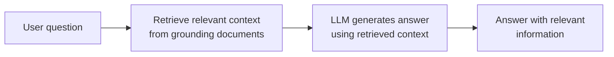
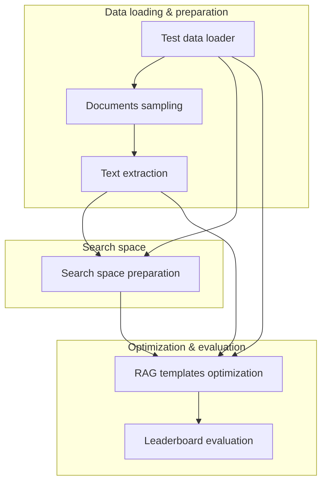
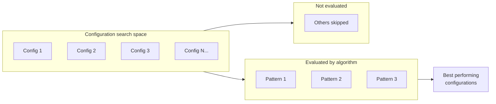

# AutoRAG

**AutoRAG** on Red Hat OpenShift AI lets you run and evaluate **Retrieval-Augmented Generation (RAG)** over your documents via the **Documents RAG Optimization Pipeline**. You provide documents and test questions in S3; the pipeline (orchestrated by Kubeflow Pipelines, using the [IBM ai4rag](https://github.com/IBM/ai4rag) optimization engine) runs against a **Llama-stack RAG server**, explores RAG configurations, and produces a **leaderboard** of RAG patterns plus artifacts (e.g. pattern configs, evaluation results, indexing and inference notebooks). See [Example scenarios](#example-scenarios) for a typical use case and a step-by-step tutorial.

**Status:** [Developer Preview](https://access.redhat.com/support/offerings/devpreview) — This feature is not yet supported with Red Hat production service level agreements (SLAs) and may change. It provides early access for testing and feedback.

---

## Table of contents

- [About AutoRAG](#about-autorag)
  - [What AutoRAG gives you](#what-autorag-gives-you)
  - [What AutoRAG supports (Developer Preview)](#what-autorag-supports-developer-preview)
  - [How it works under the hood](#how-it-works-under-the-hood)
  - [Sample notebook and experiment flow (ai4rag)](#sample-notebook-and-experiment-flow-ai4rag)
- [What you need to provide](#what-you-need-to-provide)
  - [Required](#required)
  - [Optional](#optional)
- [What you get from a run](#what-you-get-from-a-run)
- [Example scenarios](#example-scenarios)
- [Prerequisites](#prerequisites)
- [Running AutoRAG](#running-autorag)
- [📚 Tutorial: Ask questions against 2025 IBM financial reports](financial_reports_tutorial.md)
- [References](#references)

---

## About AutoRAG

### What AutoRAG gives you

AutoRAG in this preview is **pipeline-driven**: you run the **Documents RAG Optimization Pipeline** on Red Hat OpenShift AI. The pipeline loads your documents and test data from S3, runs RAG configuration optimization (ai4rag) against a **Llama-stack RAG server**, and produces a leaderboard and RAG pattern artifacts.

- **Document-based Q&A** — Your documents (e.g., PDFs or text) are stored in S3. The pipeline loads them, extracts text, and uses them as the knowledge base for RAG optimization and evaluation.
- **Test data** — A `test_data.json` file (in S3) defines the questions and expected answers used to evaluate RAG configurations.
- **RAG stack** — A **Llama-stack server** with the RAG stack (chat model, embedding model, vector store such as Milvus) is a prerequisite. See [Llama stack setup](../../llamastack/SETUP.md) for installation. The pipeline calls this stack for embedding, retrieval, and generation during optimization.
- **Leaderboard and artifacts** — When the pipeline run completes, you get an HTML leaderboard of RAG patterns ranked by your chosen metric, plus per-pattern artifacts (pattern.json, evaluation_results.json, indexing and inference notebooks) that you can use to deploy or refine your RAG application.

You run the pipeline via the AI Pipelines UI or API; no custom training code is required.

### What AutoRAG supports (Developer Preview)

In this preview, AutoRAG is exposed as the **Documents RAG Optimization Pipeline** (Kubeflow Pipelines), which uses the IBM ai4rag optimization engine against Red Hat OpenShift AI's Llama-stack RAG infrastructure.

| Area | Support |
|------|--------|
| **Documents** | Stored in S3-compatible object storage (via RHOAI Connections). |
| **Test data** | JSON file in S3 (e.g. `benchmark.json` or `test_data.json`): list of items with `question`, `correct_answers`, and `correct_answer_document_ids` for evaluation. |
| **RAG stack** | Llama-stack server with RAG stack (chat model, embedding model, vector store e.g. Milvus). See [Llama stack setup](../../llamastack/SETUP.md). |
| **Execution** | [Documents RAG Optimization Pipeline](https://github.com/LukaszCmielowski/pipelines-components/tree/rhoai_autorag/pipelines/training/autorag/documents_rag_optimization_pipeline) via AI Pipelines UI or API. |
| **What you get** | HTML leaderboard of RAG patterns, RAG pattern artifacts (pattern.json, evaluation results, indexing and inference notebooks). |

### How it works under the hood

The **Documents RAG Optimization Pipeline** runs on **Kubeflow Pipelines** and uses **RHOAI Connections** (S3 secrets) to read documents and test data from S3. It calls the **Llama-stack RAG server** (deployed as a prerequisite in your project; see [Llama stack setup](../../llamastack/SETUP.md)) for embeddings, retrieval, and LLM responses. The pipeline stages: load test data and input documents, sample and extract text (e.g. Docling), prepare the search space, run RAG templates optimization (ai4rag), evaluate patterns, and produce the leaderboard and RAG pattern artifacts.

**RAG interaction pattern** — User question → retrieve context from grounding documents → LLM generates answer with that context.

**2. Documents RAG optimization pipeline** — Kubeflow pipeline steps from the [documents RAG optimization pipeline](https://github.com/LukaszCmielowski/pipelines-components/tree/rhoai_autorag/pipelines/training/autorag/documents_rag_optimization_pipeline): load test data and input documents, sample and extract text, prepare the search space, run RAG templates optimization (HPO), then evaluate patterns on a leaderboard.

**RAG configuration optimization** — The optimizer chooses which subset of the configuration search space to evaluate (e.g. 16 candidate patterns); it ranks evaluated patterns and tags the top performers (e.g. top 3) as best, and skips the rest to avoid full grid search.

### Pipeline flow (ai4rag)

The [Documents RAG Optimization Pipeline](https://github.com/LukaszCmielowski/pipelines-components/tree/rhoai_autorag/pipelines/training/autorag/documents_rag_optimization_pipeline) uses the [IBM ai4rag](https://github.com/IBM/ai4rag) optimization engine. In that flow:

1. **Test data loading** — Loads test data (questions, expected answers) from a JSON file in S3.
2. **Document loading & sampling** — Loads documents from S3 and samples based on the test data.
3. **Text extraction** — Extracts text from sampled documents (e.g. using Docling).
4. **Search space preparation** — Builds the search space of RAG configurations (foundation models, embedding models, etc.) to try.
5. **RAG templates optimization** — Systematically tests configurations using GAM-based prediction and produces RAG patterns, metrics, and notebooks.
6. **Evaluation & leaderboard** — Evaluates each pattern on the test data and builds an HTML leaderboard ranked by the chosen metric (e.g. faithfulness, answer_correctness, context_correctness).

You provide pipeline parameters (S3 locations, Llama-stack secret name, embedding/generation model lists, optimization metric); the pipeline produces the leaderboard and RAG pattern artifacts in the run's artifact store.

---

## What you need to provide

To run the Documents RAG Optimization Pipeline, you provide:

### Required

| Item | Description |
|------|-------------|
| **Documents** | Your source documents (e.g. IBM 2025 quarterly financial reports, one file per quarter) uploaded to an S3-compatible bucket. You can download quarterly earnings presentations (PDFs) from [IBM Financial Reporting](https://www.ibm.com/investor/financial-reporting) (select year 2025 and Q1–Q4). The pipeline ingests them for RAG optimization. |
| **Test data** | A benchmark JSON file in S3 (e.g. `benchmark.json` or `test_data.json`). Format: a list of objects with `question`, `correct_answers` (list of strings), and `correct_answer_document_ids` (list of document IDs that should contain the answer). Document metadata in the extracted corpus must include `document_id` matching these IDs. |
| **S3 connections** | RHOAI Connections for: (1) pipeline results/artifacts (used by the Pipeline Server), (2) one connection for both test data and input documents (same bucket, different object keys/paths). Use the same connection name for `test_data_secret_name` and `input_data_secret_name` in the pipeline run. |
| **Llama-stack secret** | A Kubernetes secret (or connection) containing `LLAMA_STACK_CLIENT_BASE_URL` and `LLAMA_STACK_CLIENT_API_KEY` for the Llama-stack RAG server. See [Llama stack setup](../../llamastack/SETUP.md). The pipeline references it as `llama_stack_secret_name`. |
| **RAG stack** | A Llama-stack server with the RAG stack enabled (chat model, embedding model, vector store such as Milvus), deployed in the project. See [Llama stack setup](../../llamastack/SETUP.md). |

### Optional

| Item | Description |
|------|-------------|
| **Pipeline parameters** | `embeddings_models` (list of embedding model IDs), `generation_models` (list of foundation model IDs), `optimization_metric` (e.g. `faithfulness`, `answer_correctness`, `context_correctness`), `llama_stack_vector_database_id` (e.g. `ls_milvus`). See the [pipeline README](https://github.com/LukaszCmielowski/pipelines-components/tree/rhoai_autorag/pipelines/training/autorag/documents_rag_optimization_pipeline) for full input/output descriptions. |

---

## What you get from a run

When the Documents RAG Optimization Pipeline run completes, you get:

- **Leaderboard** — HTML file ranking RAG patterns by the optimization metric (e.g. faithfulness, answer_correctness, context_correctness). Use it to compare and choose the best RAG configuration.
- **RAG pattern artifacts** — For each top-N pattern: **pattern.json** (settings and scores), **evaluation_results.json** (per-question evaluation), **indexing_notebook.ipynb** (to build/populate the vector index), and **inference_notebook.ipynb** (for retrieval and generation). Use these to deploy or refine your RAG application.
- **Other artifacts** — Sampled documents metadata and extracted text (markdown) from the pipeline stages.

Artifacts are stored in the artifact store configured for your run (e.g. S3 via your Pipeline Server). Open the run's **Artifacts** in the Pipelines UI to download the leaderboard and RAG pattern outputs.

---

## Example scenarios

AutoRAG in this preview is aimed at **document Q&A and evaluation**: you have a set of documents (e.g. reports, manuals) and a list of questions; you run the notebook to get answers and inspect retrieval and quality.

| Scenario | Your data | What you do | Outcome |
|----------|-----------|-------------|---------|
| **Financial reports Q&A** | Sample data in `data/financial_reports/`: input documents in [input_data/](data/financial_reports/input_data/) and [benchmark_data.json](data/financial_reports/benchmark_data.json) (sourced from [IBM Financial Reporting](https://www.ibm.com/investor/financial-reporting)) | Run the Documents RAG Optimization Pipeline against the Llama-stack RAG server | Leaderboard of RAG patterns; pattern configs and notebooks for deployment. |
| **Internal docs Q&A** | Policy or product docs in S3; test questions in JSON | Same flow | Leaderboard and RAG pattern artifacts; use inference notebooks for Q&A. |
| **Evaluation run** | Documents + test set with expected answers | Run pipeline | Compare patterns by metric (e.g. faithfulness, answer_correctness); deploy the best pattern. |

To try this yourself, follow the [📚 Tutorial: Ask questions against 2025 IBM financial reports](financial_reports_tutorial.md): use the sample data in `data/financial_reports/` ([input_data/](data/financial_reports/input_data/) and [benchmark_data.json](data/financial_reports/benchmark_data.json); documents are sourced from [IBM Financial Reporting](https://www.ibm.com/investor/financial-reporting)), upload it to S3, ensure the [Llama stack is set up](../../llamastack/SETUP.md) and the RAG stack is ready, add and run the Documents RAG Optimization Pipeline, and view the leaderboard and RAG pattern artifacts.

---

## Prerequisites

- **Red Hat OpenShift AI** installed and accessible, with **Kubeflow Pipelines** available.
- A **data science project** and a **Pipeline Server** configured with object storage for runs and artifacts.
- **Llama stack** set up — See [Llama stack setup](../../llamastack/SETUP.md) for installation and configuration.
- **Llama-stack server with RAG stack** — Deploy and configure a Llama-stack server in the project with the RAG stack (chat model, embedding model, and vector store such as Milvus). Follow [Llama stack setup](../../llamastack/SETUP.md). The pipeline will use this server for retrieval and generation. See also [Deploying a RAG stack in a project](https://docs.redhat.com/en/documentation/red_hat_openshift_ai_self-managed/3.0/html/working_with_llama_stack/deploying-a-rag-stack-in-a-project_rag) and [Build AI/Agentic Applications with Llama Stack](https://docs.redhat.com/en/documentation/red_hat_openshift_ai_self-managed/3.2/html-single/working_with_llama_stack/working_with_llama_stack).
- **S3 connections** (RHOAI Connections) for: (1) pipeline results/artifacts (Pipeline Server), (2) one connection for test data and input documents (same bucket, different keys/paths).
- **Llama-stack secret** — A secret (or connection) with `LLAMA_STACK_CLIENT_BASE_URL` and `LLAMA_STACK_CLIENT_API_KEY` for the pipeline to call the RAG server.

---

## Running AutoRAG

You run AutoRAG by **running the Documents RAG Optimization Pipeline**:

1. Ensure the **Llama-stack RAG stack** is deployed (see [Llama stack setup](../../llamastack/SETUP.md)) and that you have created a secret (or connection) with `LLAMA_STACK_CLIENT_BASE_URL` and `LLAMA_STACK_CLIENT_API_KEY` for the pipeline to use.
2. Ensure the **sample documents** from [data/financial_reports/input_data/](data/financial_reports/input_data/) and the **benchmark** file [benchmark_data.json](data/financial_reports/benchmark_data.json) are uploaded to S3 (same bucket, different paths), and that you have an S3 connection for that data plus a Pipeline Server configured with a results connection for artifacts.
3. Add the **Documents RAG Optimization Pipeline** as a Pipeline Definition (from [pipelines-components](https://github.com/LukaszCmielowski/pipelines-components/tree/rhoai_autorag/pipelines/training/autorag/documents_rag_optimization_pipeline), branch `rhoai_autorag`).
4. Create a pipeline run and set the required parameters: use the same connection and bucket for test data and input documents (different object keys); Llama-stack secret name; embeddings_models and generation_models lists; optimization_metric.
5. **View the results** in the run's Artifacts: leaderboard HTML and RAG pattern artifacts (pattern.json, evaluation_results.json, indexing and inference notebooks).

For a step-by-step walkthrough, see the [📚 Tutorial: Ask questions against 2025 IBM financial reports](financial_reports_tutorial.md).

---

## 📚 Tutorial: Ask questions against 2025 IBM financial reports

**Scenario:** You use the **sample data** in `data/financial_reports/`: **input documents** (IBM financial reports) in `input_data/` and **benchmark_data.json** with questions (sourced from [IBM Financial Reporting](https://www.ibm.com/investor/financial-reporting)). The goal is to run the **Documents RAG Optimization Pipeline** on Red Hat OpenShift AI against a **Llama-stack RAG server**, then view the leaderboard and RAG pattern artifacts (configs, evaluation results, indexing and inference notebooks).

**Step-by-step guide:** The full tutorial walks you through creating a project, deploying the Llama-stack server with the RAG stack, creating S3 and Llama-stack connections, uploading documents and test data to S3, adding the Documents RAG Optimization Pipeline as a Pipeline Definition, running the pipeline with the required parameters, and viewing the leaderboard and RAG pattern artifacts. Follow the tutorial here: **[Financial reports tutorial](financial_reports_tutorial.md)**.

---

## References

- [Documents RAG Optimization Pipeline](https://github.com/LukaszCmielowski/pipelines-components/tree/rhoai_autorag/pipelines/training/autorag/documents_rag_optimization_pipeline) — Pipeline definition, inputs, outputs, and artifact layout (branch `rhoai_autorag`)
- [Llama stack setup](../../llamastack/SETUP.md) — Installation and configuration for the Llama-stack RAG server (prerequisite for AutoRAG)
- [IBM ai4rag](https://github.com/IBM/ai4rag) — RAG templates and optimization engine used by the pipeline
- [Deploying a RAG stack in a project (Red Hat OpenShift AI)](https://docs.redhat.com/en/documentation/red_hat_openshift_ai_self-managed/3.0/html/working_with_llama_stack/deploying-a-rag-stack-in-a-project_rag)
- [Build AI/Agentic Applications with Llama Stack (Red Hat OpenShift AI)](https://docs.redhat.com/en/documentation/red_hat_openshift_ai_self-managed/3.2/html-single/working_with_llama_stack/working_with_llama_stack)
- [Managing AI pipelines (Red Hat OpenShift AI)](https://docs.redhat.com/en/documentation/red_hat_openshift_ai_self-managed/3.2/html/working_with_ai_pipelines/managing-ai-pipelines_ai-pipelines)
- [Using connections (Red Hat OpenShift AI)](https://docs.redhat.com/en/documentation/red_hat_openshift_ai_self-managed/2.22/html/working_on_data_science_projects/using-connections_projects)
