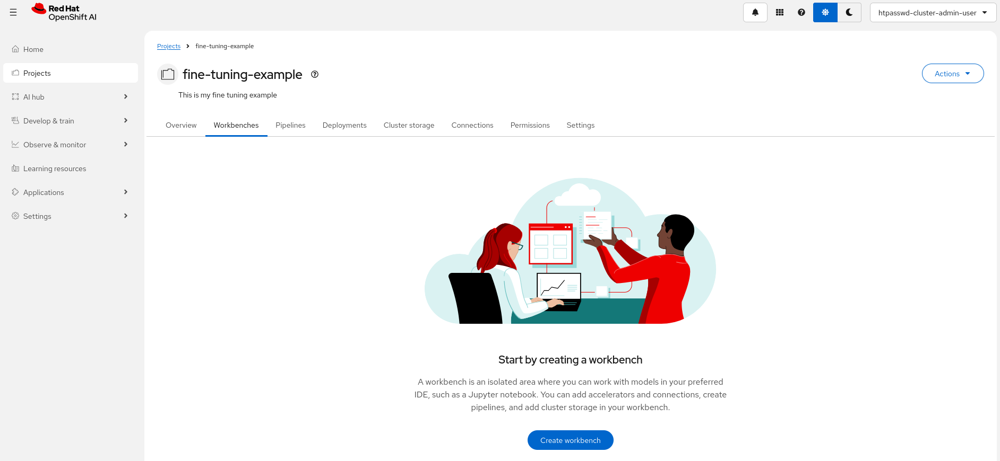
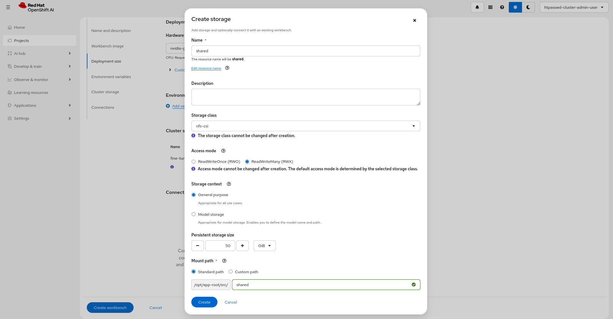

# GRPO Fine-Tuning with Training Hub

This example provides an overview of Training Hub's [GRPO (Group Relative Policy Optimization)](https://github.com/Red-Hat-AI-Innovation-Team/training_hub?tab=readme-ov-file#grpo) capabilities and demonstrates how to use them with Red Hat OpenShift AI.

## What is GRPO?

GRPO is a reinforcement learning from verifiable rewards (RLVR) algorithm that improves a model's outputs by comparing groups of responses and reinforcing the better ones:

- Generates multiple candidate responses per prompt
- Scores them with a reward function (e.g. tool-call correctness)
- Uses the group's relative ranking to compute advantage signals
- Updates LoRA adapter weights via policy gradient with group normalization

Each training iteration has two phases:

1. **Rollout phase** — vLLM generates candidate responses and a reward function scores them
2. **Train phase** — Unsloth updates the LoRA adapter weights using the advantage signals

The ART backend time-shares a single GPU between vLLM (inference) and Unsloth (training) via `gpu_memory_utilization`.

### Training Task: Tool-Call Verification

The example uses the [Agent-Ark/Toucan-1.5M](https://huggingface.co/datasets/Agent-Ark/Toucan-1.5M) dataset, which contains tool-calling conversations. The reward function verifies that the model produces syntactically correct tool calls with the expected function name and arguments.

## Execution mode

GRPO runs as a **single-GPU TrainJob** submitted via the Kubeflow SDK. ART is single-GPU by design and manages its own vLLM subprocess internally.

The notebook submits a `TrainJob` from a lightweight workbench, and the training runs on a dedicated GPU pod managed by Kubeflow Trainer.

To learn more about execution modes for other algorithms, see the [fine-tuning execution modes overview](../README.md#execution-modes).

## RHOAI compatibility

This example is compatible with RHOAI version 3.5.

## Requirements

- An OpenShift cluster with OpenShift AI (RHOAI 3.5) installed:
  - The `dashboard` and `workbenches` components enabled
  - The `trainer` component enabled
- A worker node with an NVIDIA GPU (Ampere-based or newer, 40GB+ VRAM).
- A dynamic storage provisioner supporting RWX PVC provisioning. Talk to your cluster administrator about RWX storage options.

## Hardware requirements

For the workbench image, the example was run on `Training | Jupyter | PyTorch | CUDA | Python` and `Training | Jupyter | PyTorch | CPU Python`.
This is a single image serving both as training runtime and jupyter notebook and comes with pre-installed dependencies required
to seamlessly run fine-tuning jobs.

### Workbench Requirements

| Image Type | Use Case | GPU | CPU | Memory |
|------------|----------|-----|-----|--------|
| Training \| Jupyter \| PyTorch \| CPU Python | Job submission and monitoring | None | 2 cores | 8Gi |
| Training \| Jupyter \| PyTorch \| CUDA \| Python | Job submission + model evaluation | 1× GPU | 2 cores | 8Gi |

> [!NOTE]
>
> - The workbench does not run the training itself — it submits a TrainJob and monitors progress.
> - A GPU on the workbench is only needed if you want to load and test the fine-tuned LoRA adapter after training completes.

### Training Pod Requirements

| Component | GPU | GPU Type | CPU | Memory |
|-----------|-----|----------|-----|--------|
| Training Pod | 1× GPU | NVIDIA A100, H100, or L40S (40GB+ VRAM) | 8 cores | 64Gi |

> [!NOTE]
>
> - GRPO requires a single GPU with at least 40GB VRAM. The `gpu_memory_utilization` parameter (default `0.45`) controls how much GPU memory is reserved for vLLM inference, with the remainder available for Unsloth training.
> - CPU and memory requirements scale with model size and group size. The above values suit the example configuration (Qwen3-4B, group_size=4).
> - The training pod is configured from the `client.train()` call within the notebook.

### Storage Requirements

| Purpose | Size | Access Mode | Storage Class | Notes |
|---------|------|-------------|---------------|-------|
| Shared Storage (PVC) total | 50Gi (Example Default) | RWX | Dynamic provisioner required | Shared between workbench and training pod |

> [!NOTE]
>
> - Storage can be created in `Create Workbench` view on RHOAI Platform, however, dynamic RWX provisioner is required to be configured prior to creating shared file storage in RHOAI.
> - Shared storage is required — the training pod writes checkpoints and metrics to the PVC, and the workbench reads them for inspection and plotting.

## GRPO-specific considerations

- **`/dev/shm` volume**: vLLM requires a memory-backed `/dev/shm` for inter-process communication. The notebook configures this automatically via a `PodSpecOverride` that mounts an `emptyDir` with `medium: Memory`.
- **`gpu_memory_utilization`**: Controls the vLLM/Unsloth memory split on the single GPU. The default `0.45` reserves 45% for vLLM inference and leaves the rest for Unsloth training. Adjust based on your model size and available VRAM.
- **HuggingFace token**: Not strictly required for public models (e.g. Qwen3-4B) but recommended to avoid rate limits. Set `HF_TOKEN` in the environment variables if needed.

## Setup

### Setup Workbench

**Step 1.** Access the OpenShift AI dashboard, for example from the top navigation bar menu:

**Step 2.** Log in, then go to **_Data Science Projects_** and create a project:

**Step 3.** Once the project is created, click on **_Create a workbench_**:

**Step 4.** Select the appropriate Workbench image. See options above:

**Step 5.** You may want to create a **Hardware Profile** with GPU support, similar to the one below:

**Step 6.** Select the Hardware profile you want to use:

> [!NOTE]
> A GPU on the workbench is only needed if you want to test the fine-tuned model after training. The workbench itself only submits and monitors the TrainJob.

**Step 7.** Create **shared storage** that will be shared between the workbench and the training pod. Make sure it uses a storage class with RWX capability:

> [!NOTE]
> You can attach an existing shared storage if you already have one instead.

**Step 8.** Review the storage configuration and click "Create workbench":

**Step 9.** From "Workbenches" page, click on **_Open_** when the workbench you've just created becomes ready:

### Running the example notebook

- From the workbench, clone this repository: `https://github.com/red-hat-data-services/red-hat-ai-examples.git`
- Navigate to the `examples/fine-tuning/grpo` directory and open the [`grpo_lora-kubeflow-trainjob.ipynb`](./grpo_lora-kubeflow-trainjob.ipynb) notebook.

> [!NOTE]
>
> - You will need a Hugging Face token if using gated models (e.g., Llama models).
>   Set the `HF_TOKEN` environment variable in your job configuration.
>   You can skip the token if switching to non-gated models like Qwen3-4B.

You can now proceed with the instructions from the notebook. Enjoy!
