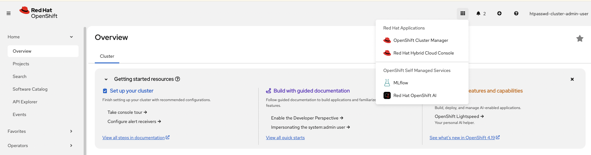
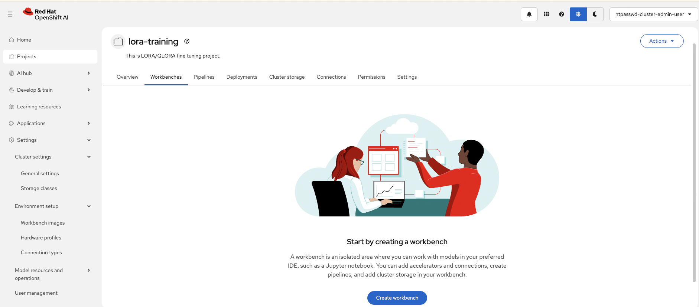
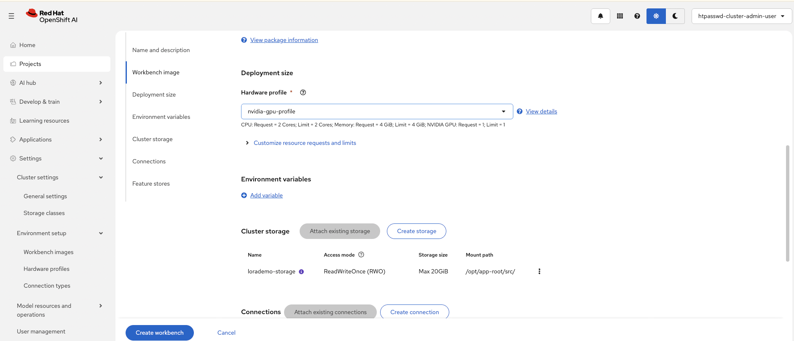
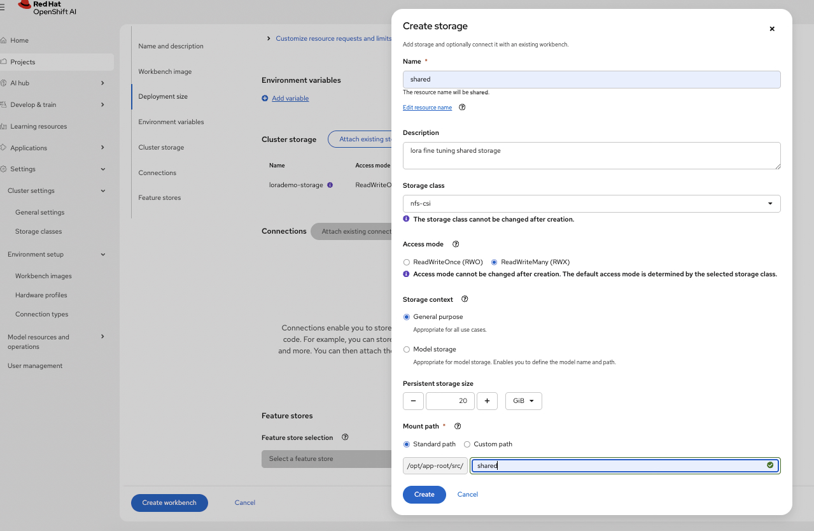
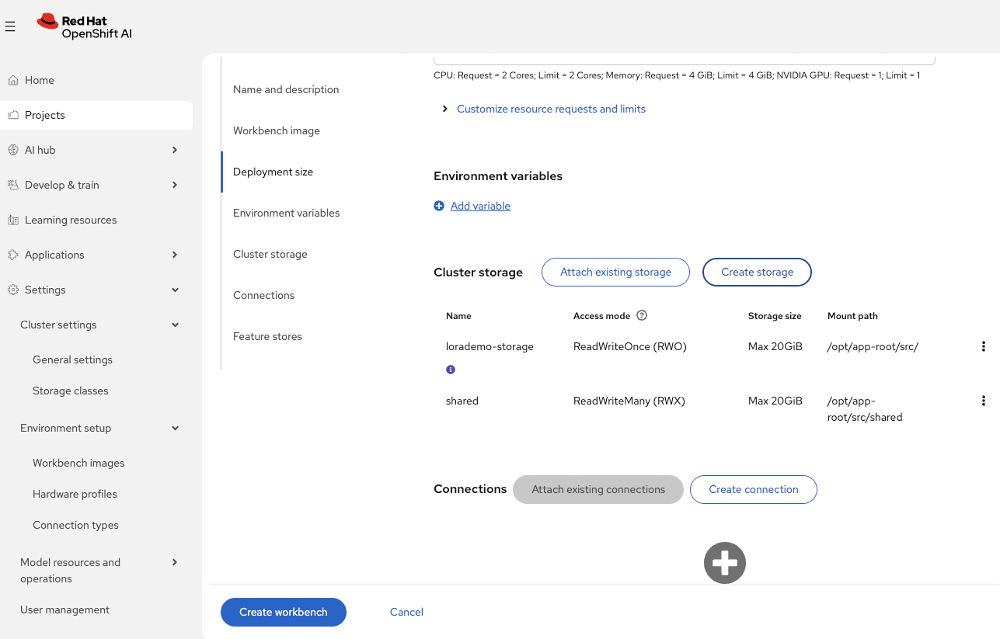
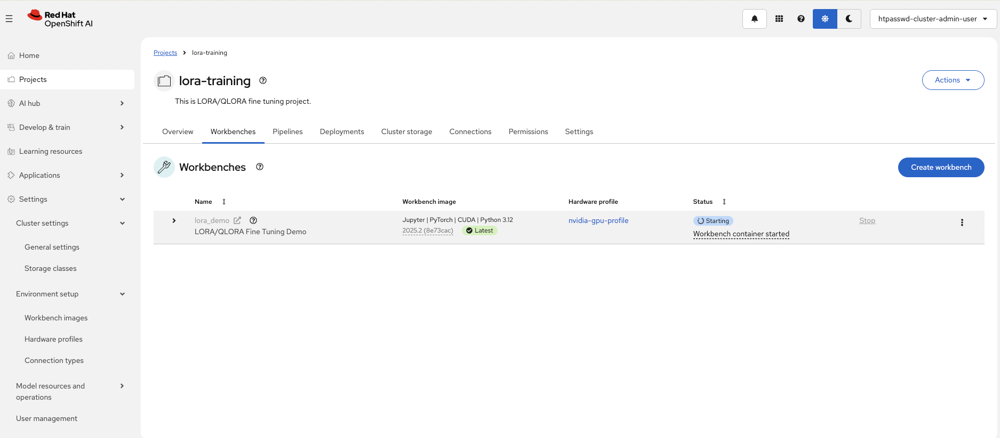

# LoRA/QLoRA Fine-Tuning with Training Hub

This example provides an overview of the LORA algorithm and an example on how to use it with Red Hat OpenShift AI.

This notebook demonstrates how to use Training Hub's LoRA (Low-Rank Adaptation) and QLoRA capabilities for parameter-efficient fine-tuning. We'll train a model to convert natural language questions into SQL queries using the popular [sql-create-context](https://huggingface.co/datasets/b-mc2/sql-create-context) dataset.

## What is LoRA?

LoRA (Low-Rank Adaptation) is a parameter-efficient fine-tuning technique that:

- Freezes the pre-trained model weights
- Injects trainable low-rank matrices into each layer
- Reduces trainable parameters by ~10,000x compared to full fine-tuning
- Enables fine-tuning large models on consumer GPUs

**QLoRA** extends LoRA by adding 4-bit quantization, further reducing memory requirements while maintaining quality.

## Training Task: Natural Language to SQL

We'll train the model to understand database schemas and generate SQL queries from natural language questions. For example:

**Input:**

```text
Table: employees (id, name, department, salary)
Question: What is the average salary in the engineering department?
```

**Output:**

```sql
SELECT AVG(salary) FROM employees WHERE department = 'engineering'
```

## Execution modes

## Note

LORA/QLORA supports two execution modes:

- **Interactive Notebooks (Single Node Fine Tuning)**: training runs directly in a workbench on a single pod, demonstrated by `lora-interactive-notebook.ipynb`.
- **Training Jobs (Distributed Fine Tuning with Kubeflow Trainer)**: training runs as distributed jobs across multiple nodes/pods via Kubeflow Trainer, demonstrated by `lora-distributed.ipynb`.

## Hardware requirements to run the example notebook

### Workbench Requirements (interactive mode)

| Image Type | Use Case | GPU | CPU | Memory | Notes |
|------------|----------|-----|-----|--------|-------|
| CUDA PyTorch Python 3.12 | NVIDIA GPU training | 1× GPU | 4 cores | 32Gi | Recommended for faster training |

> [!NOTE]
>
> - Interactive mode is recommended for smaller training jobs.
> - For larger training jobs consider the distributed training approach.

### Training Job Requirements (Distributed example)

| Component | Configuration | GPU per node | Total GPU | GPU Type (per GPU) | CPU | Memory |
|-----------|--------------|---|---|------------|-----|--------|
| Training Pods | 2 nodes × 2 GPUs | 2 | 4 | NVIDIA L40/L40S or equivalent | 4 cores/pod | 32Gi/pod |

> [!NOTE]
>
> - This example was tested on 2 nodes x 2 GPUs provided by L40S however, it will work on smaller/larger configurations.
> - CPU and Memory requirements scale with batch size and model size. Above suit the example as it is.
> - Worker pods are configurable from the `client.create_job` call within the notebook.

### Workbench Requirements (Distributed example)

| Image Type | Use Case | GPU | CPU | Memory | Notes |
|------------|----------|-----|-----|--------|-------|
| Minimal CPU Python 3.12 | CPU-based evaluation | None | 6 cores | 24Gi | Slower evaluation |
| Minimal CUDA Python 3.12 (Example Default) | NVIDIA GPU evaluation (Example Default) | 1× GPU | 2 cores | 8Gi | Recommended for faster testing |

> [!NOTE]
>
> - Workbench GPU is optional but recommended for faster model evaluation
> - Evaluation was performed on L40S GPU however, it will work on smaller/larger configurations.
> - Workbench resources and accelerator are configurable in `Create Workbench` view on RHOAI Platform

### Storage Requirements (Distributed example)

| Purpose | Size | Access Mode | Storage Class | Notes |
|---------|------|-------------|---------------|-------|
| Shared Storage (PVC) total | 20Gi (Example Default) | RWX | Dynamic provisioner required | Shared between workbench and training pods |

> [!NOTE]
>
> - Storage can be created in `Create Workbench` view on RHOAI Platform, however, dynamic RWX provisioner is required to be configured prior to creating shared file storage in RHOAI.
> - Shared storage is not required for the interactive example as dataset, model download and training all happen on the same pod.

## Setup

### Setup Workbench

- **Access the OpenShift AI dashboard**, for example from the top navigation bar menu:
  

- Log in, then go to **_Projects_** and create a project:
  

- Once the project is created, click on **_Create a workbench_**:
  

- Then create a workbench with the following settings:
  - Select the appropriate Workbench based on interactive or distributed use case. See options above:
    

  - Similarly, you may want to add a **Hardware Profile** for reuse within the Workbench settings
    

  - Select the Hardware profile just created:
    
    > [!NOTE]
    > Adding an accelerator (GPU) for the distributed use case is only needed to test the fine-tuned model from within the workbench so you can spare an accelerator if you plan to skip that step. An accelerator (GPU) is required in interactive mode as the training happens on the workbench pod.

  - For distributed training, create **shared storage** that'll be shared between the workbench and the training pods.
    Make sure it uses a storage class with RWX capability and set it to 20GiB in size.
    
    > [!NOTE]
    > For the interactive mode example, dataset, model download, and training all happen on the same pod, so shared storage is not required.
    > You can attach an existing shared storage if you already have one instead.

  - Review the storage configuration and click "Create workbench":
    

- From "Workbenches" page, click on **_Open_** when the workbench you've just created becomes ready:
  

> [!IMPORTANT]
>
> - By default:
>   - The example goes through distributed training on two nodes (2xL40/L40S) with two GPUs each (2x48GB). However, it can be tweaked to run on smaller configurations.
>   - If you want to do model evaluation part of the distributed example, ideally an accelerator is attached to the workbench
>   - For the interactive example an accelerator is required for the WorkBench to execute the fine tuning with LORA.

### Running the example notebooks

- From the workbench, clone this repository, i.e., `https://red-hat-data-services/red-hat-ai-examples.git`
  
- Navigate to the `examples/fine-tuning/lora` directory and open the [`lora_sft-interactive-notebook.ipynb`](./lora_sft-interactive-notebook.ipynb) notebook or [`lora_sft-distributed.ipynb`](./lora_sft-distributed.ipynb) as required
