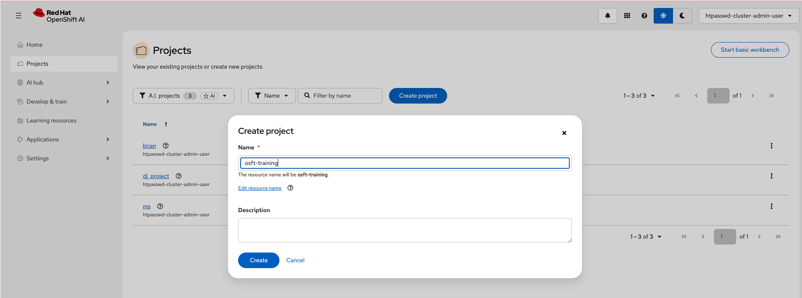
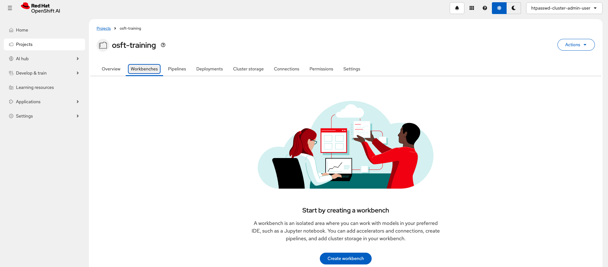
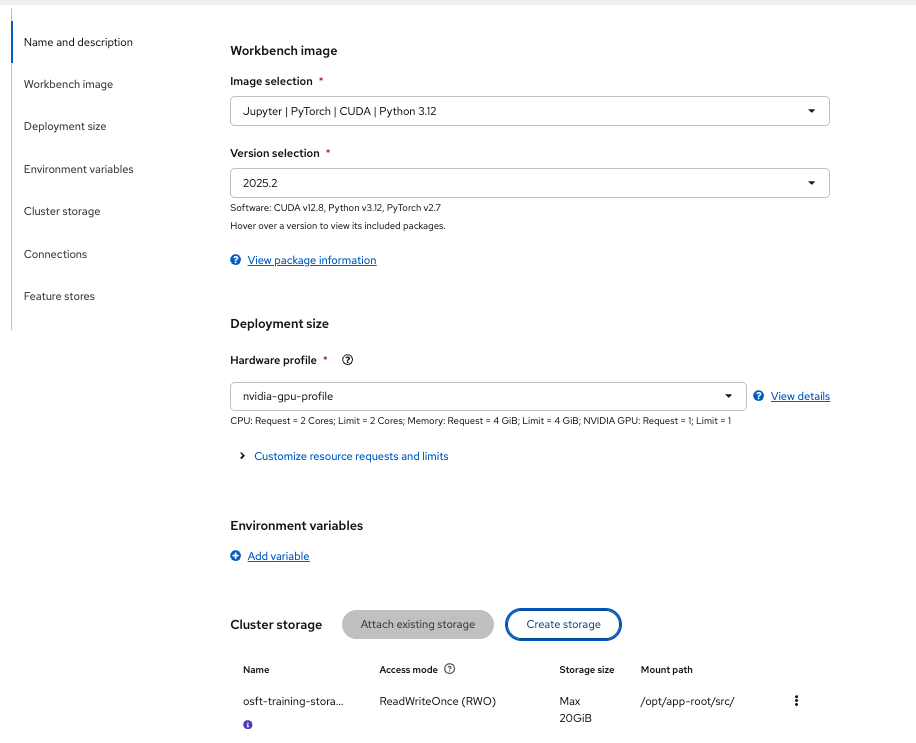
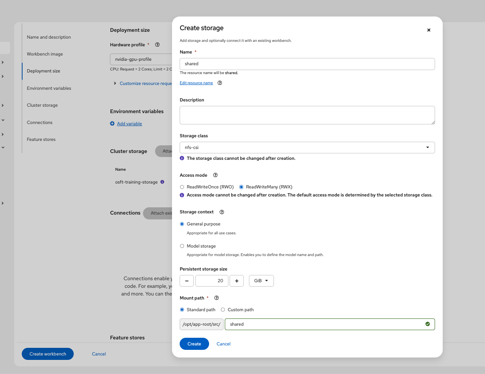
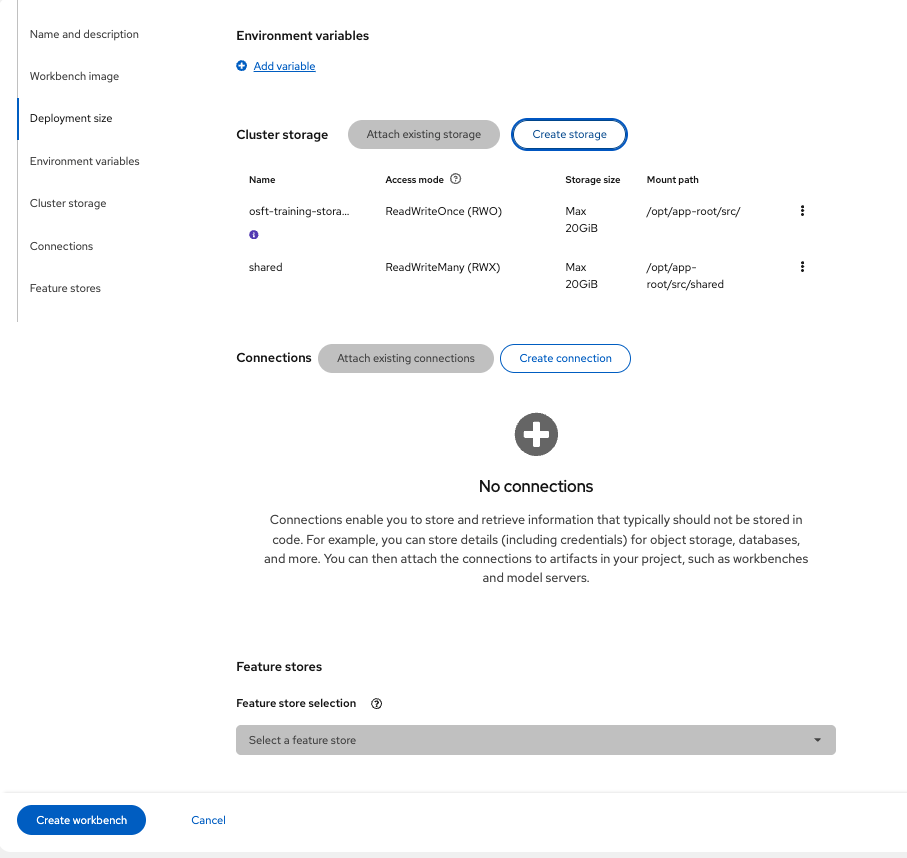
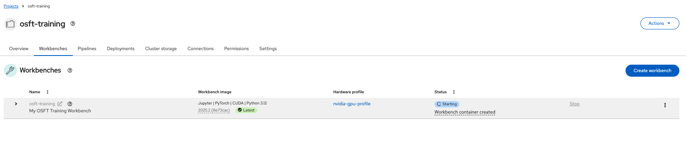

# OSFT Continual Learning on Red Hat OpenShift AI (RHOAI)

This guide provides an overview of the [OSFT algorithm from Training Hub](https://github.com/Red-Hat-AI-Innovation-Team/training_hub/tree/main?tab=readme-ov-file#orthogonal-subspace-fine-tuning-osft) and examples on how to use it with Red Hat OpenShift AI.

## Execution modes

OSFT supports two execution modes:

- **Interactive Notebooks (Single Node Fine Tuning)**: training runs directly in a workbench on a single pod, demonstrated by `osft-interactive-notebook.ipynb`.
- **Training Jobs (Distributed Fine Tuning with Kubeflow Trainer)**: training runs as distributed jobs across multiple nodes/pods via Kubeflow Trainer, demonstrated by `osft-distributed.ipynb`.

While workbench setup is similar for both, we highlight specific configuration differences below.

To learn more about these execution modes, see the [fine-tuning execution modes overview](../README.md#execution-modes).

## RHOAI compatibility

This example is compatible with RHOAI version 3.3. For a version compatible with RHOAI 3.2 see [this README](../rhoai-3.2/osft/README.md). For RHOAI 3.0 see [this README](../rhoai-3.0/osft/README.md).

## Overview

Fine-tuning language models is hard—you need good data, lots of resources, and even small changes can cause problems. This makes it tough to add new abilities to a model. This problem is called continual learning and is what our new training technique, orthogonal subspace fine-tuning (OSFT), solves.

The OSFT algorithm implements Orthogonal Subspace Fine-Tuning based on Nayak et al. (2025), arXiv:2504.07097. This algorithm allows for continual training of pre-trained or instruction-tuned models without the need of a supplementary dataset to maintain the distribution of the original model/dataset that was trained.

**Key Benefits:**

- Enables continual learning without catastrophic forgetting
- No need for supplementary datasets to maintain original model distribution
- Significantly reduces data requirements for customizing instruction-tuned models
- Memory requirements similar to standard SFT

### Data Format Requirements

Training Hub's OSFT algorithm supports both **processed** and **unprocessed** data formats via the [mini-trainer](https://github.com/Red-Hat-AI-Innovation-Team/mini_trainer/) backend.

#### Option 1: Standard Messages Format (Recommended)

Your training data should be a **JSON Lines (.jsonl)** file containing messages data:

```json
{"messages": [{"role": "system", "content": "You are a helpful assistant."}, {"role": "user", "content": "Hello!"}, {"role": "assistant", "content": "Hi there! How can I help you?"}]}
{"messages": [{"role": "user", "content": "What is OSFT?"}, {"role": "assistant", "content": "OSFT stands for Orthogonal Subspace Fine-Tuning..."}]}
```

#### Message Structure

- **`role`**: One of `"system"`, `"user"`, `"assistant"`, or `"pretraining"`
- **`content`**: The text content of the message
- **`reasoning_content`** (optional): Additional reasoning traces

#### Masking Control with `unmask_messages` Parameter

Control training behavior during data processing:

**Standard instruction tuning (default):**

```python
osft(..., unmask_messages=False)  # Only assistant responses used for loss
```

**Pretraining mode:**

```python
osft(..., unmask_messages=True)   # All content except system messages used for loss
```

#### Option 2: Pre-processed Dataset

If you have pre-processed data with `input_ids` and `labels` fields:

```json
{"input_ids": [1, 2, 3, ...], "labels": [1, 2, 3, ...]}
{"input_ids": [4, 5, 6, ...], "labels": [4, 5, 6, ...]}
```

Use with:

```python
osft(..., use_processed_dataset=True)
```

## General requirements to run the example notebook

- An OpenShift cluster with OpenShift AI (RHOAI 3.3) installed:
  - The `dashboard` and `workbenches` components enabled
  - The `trainer` component should be enabled if running the distributed notebook.

## Hardware requirements to run the example notebook

### Workbench Requirements (Interactive example)

| Image Type | Use Case | GPU | CPU | Memory | Notes |
|------------|----------|-----|-----|--------|-------|
| CUDA PyTorch Python 3.12 | NVIDIA GPU training | 1× GPU | 4 cores | 32Gi | Recommended for faster training |

> [!NOTE]
>
> - **Interactive notebooks (single node fine tuning)** are recommended for smaller training jobs.
> - For larger training jobs, consider the **training jobs (distributed fine tuning with Kubeflow Trainer)** approach.

### Training Job Requirements (Distributed example)

| Component | Configuration | GPU per node | Total GPU | GPU Type (per GPU) | CPU | Memory | Flash Attention |
|-----------|--------------|---|---|------------|-----|--------|-----------------|
| Training Pods | 2 nodes × 2 GPUs | 2 | 4 | NVIDIA L40/L40S or equivalent | 4 cores/pod | 32Gi/pod | Required |

> [!NOTE]
>
> - This example was tested on 2 nodes x 2 GPUs provided by L40S however, it will work on smaller/larger configurations.
> - Flash Attention is required for efficient training.
> - CPU and Memory requirements scale with batch size and model size. Above suit the example as it is.
> - Worker pods are configurable from the `client.create_job` call within the notebook.

### Workbench Requirements (Distributed example)

| Image Type | Use Case | GPU | CPU | Memory | Notes |
|------------|----------|-----|-----|--------|-------|
| Minimal CPU Python 3.12 | CPU-based evaluation | None | 6 cores | 24Gi | Slower evaluation |
| Minimal CUDA Python 3.12 (Example Default) | NVIDIA GPU evaluation (Example Default) | 1× GPU | 2 cores | 8Gi | Recommended for faster testing |

> [!NOTE]
>
> - Workbench GPU is optional but recommended for faster model evaluation
> - Evaluation was performed on L40S GPU however, it will work on smaller/larger configurations.
> - Workbench resources and accelerator are configurable in `Create Workbench` view on RHOAI Platform

### Storage Requirements (Distributed example)

| Purpose | Size | Access Mode | Storage Class | Notes |
|---------|------|-------------|---------------|-------|
| Shared Storage (PVC) total | 10Gi (Example Default) | RWX | Dynamic provisioner required | Shared between workbench and training pods |

> [!NOTE]
>
> - Storage can be created in `Create Workbench` view on RHOAI Platform, however, dynamic RWX provisioner is required to be configured prior to creating shared file storage in RHOAI.
> - Shared storage is not required for the interactive example as dataset, model download and training all happen on the same pod.

## Setup

### Setup Workbench

- **Access the OpenShift AI dashboard**, for example from the top navigation bar menu:
  

- Log in, then go to **_Data Science Projects_** and create a project:
  

- Once the project is created, click on **_Create a workbench_**:
  

- Then create a workbench with the following settings:
  - Select the appropriate Workbench based on interactive or distributed use case. See options above:
    

  - Similarly, you may want to add a **Hardware Profile** for reuse within the Workbench settings
    

  - Select the Hardware profile just created:
    
    > [!NOTE]
    > Adding an accelerator (GPU) for the distributed use case is only needed to test the fine-tuned model from within the workbench so you can spare an accelerator if you plan to skip that step. An accelerator (GPU) is required in interactive mode as the training happens on the workbench pod.

  - For distributed training, create **shared storage** that'll be shared between the workbench and the training pods.
    Make sure it uses a storage class with RWX capability and set it to 15GiB in size.
    
    > [!NOTE]
    > For the interactive example, dataset, model download, and training all happen on the same pod, so shared storage is not required.
    > You can attach an existing shared storage if you already have one instead.

  - Review the storage configuration and click "Create workbench":
    

- From "Workbenches" page, click on **_Open_** when the workbench you've just created becomes ready:
  

> [!IMPORTANT]
>
> - By default:
>   - The example goes through distributed training on two nodes (2xL40/L40S) with two GPUs each (2x48GB). However, it can be tweaked to run on smaller configurations.
>   - If you want to do model evaluation part of the distributed example, ideally an accelerator is attached to the workbench
>   - For the interactive example an accelerator is required for the WorkBench to execute the fine tuning with OSFT.

### Running the example notebooks

- From the workbench, clone this repository, i.e., `https://red-hat-data-services/red-hat-ai-examples.git`
  
- Navigate to the `examples/fine-tuning/osft` directory and open the [`osft-interactive-notebook.ipynb`](./osft-interactive-notebook.ipynb) notebook or [`osft-distributed.ipynb`](./osft-distributed.ipynb) as required
