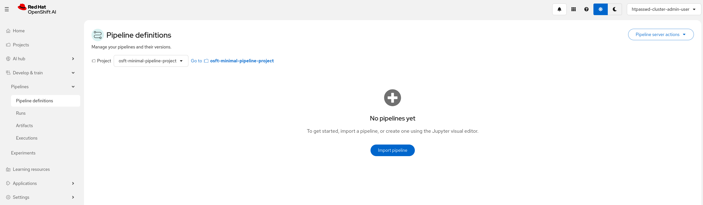
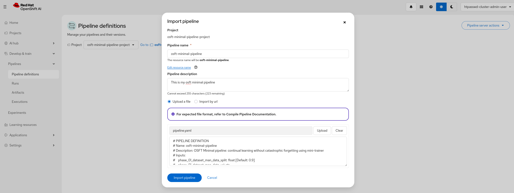
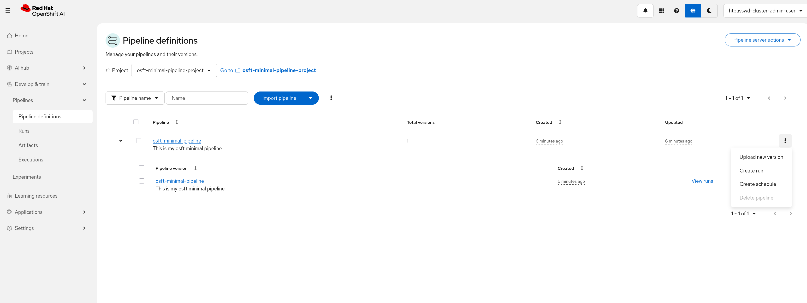
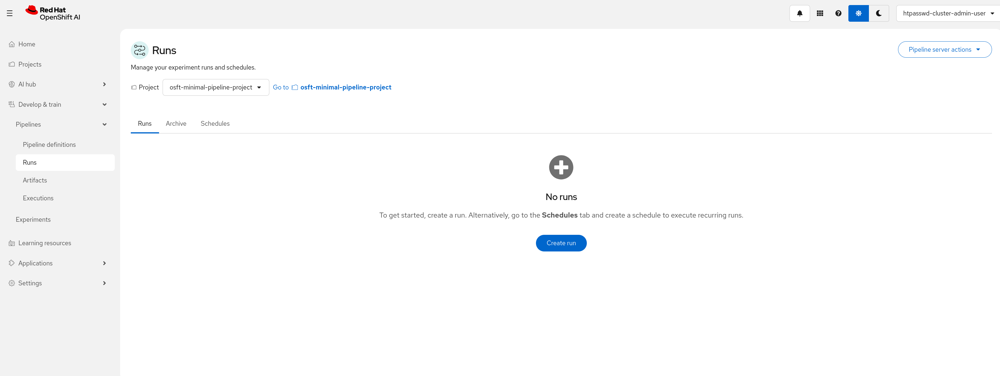
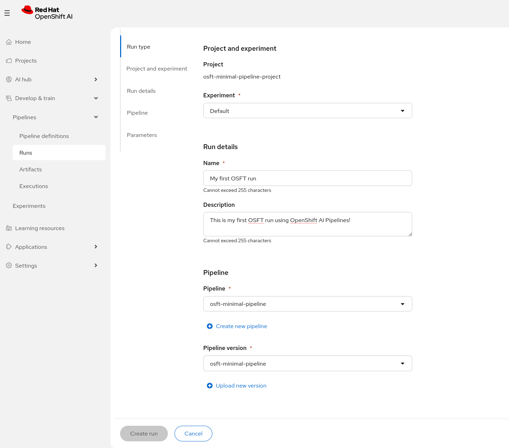
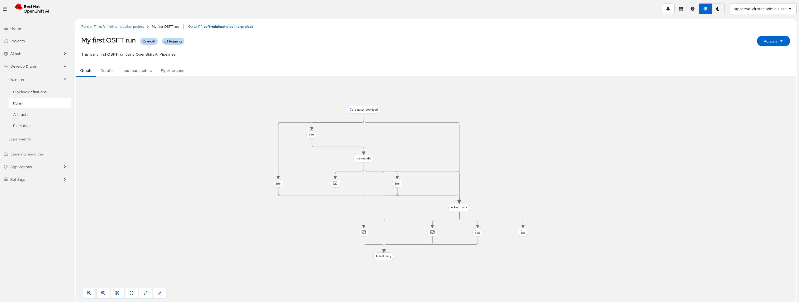
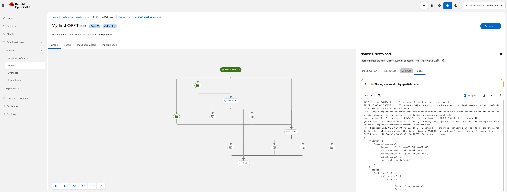
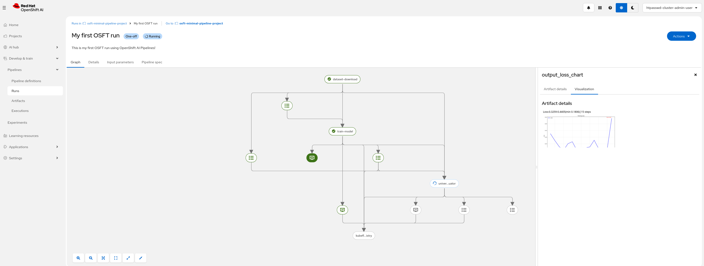
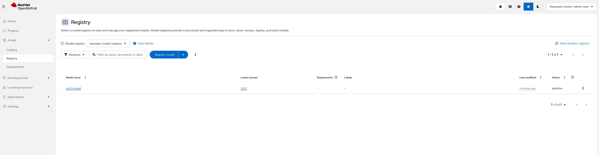
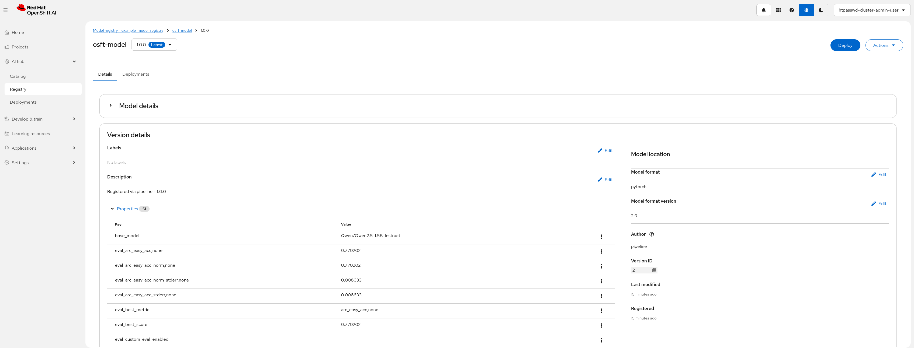

# Fine-tuning pipelines on Red Hat OpenShift AI (RHOAI)

This guided example goes through setting up the Training Hub's fine-tuning pipeline on Red Hat OpenShift AI.
The pipeline goes through a few steps with the purpose to provide an easy way of dataset download, fine-tuning, evaluation and registering the model.

## Note

This example is compatible with RHOAI version 3.3

## Pipelines Overview

The pipelines are built using modular, reusable KFP components that can be integrated into your own custom pipelines.

There are four flavours of the pipelines:

- **[OSFT](https://github.com/red-hat-data-services/pipelines-components/tree/main/pipelines/training/osft)** - Expert-level pipeline with extensive parameters for fine-grained control over OSFT-based fine-tuning.
- **[OSFT-minimal](https://github.com/red-hat-data-services/pipelines-components/tree/main/pipelines/training/osft_minimal)** - Entry-level pipeline with a single required parameter for OSFT-based fine-tuning.
- **[SFT](https://github.com/red-hat-data-services/pipelines-components/tree/main/pipelines/training/sft)** - Expert-level pipeline with extensive parameters for fine-grained control over SFT-based fine-tuning.
- **[SFT-minimal](https://github.com/red-hat-data-services/pipelines-components/tree/main/pipelines/training/sft_minimal)** - Entry-level pipeline with a single required parameter for SFT-based fine-tuning.

Each of the pipelines consists of **four** components:

- **[Dataset Download](https://github.com/red-hat-data-services/pipelines-components/tree/main/components/data_processing/dataset_download)** - Downloads and validates the dataset, ensuring it's in the format required by the Training Hub. Provides dataset split for training and evaluation components if required.
- **[Fine-Tuning](https://github.com/red-hat-data-services/pipelines-components/tree/main/components/training/finetuning)** - Downloads the base model, performs fine-tuning, produces training metrics and training loss chart
- **[Evaluation](https://github.com/red-hat-data-services/pipelines-components/tree/main/components/evaluation/lm_eval)** - Uses LM-Eval harness to evaluate the fine-tuned model against benchmark tasks or evaluation split and produce metrics
- **[Model Registry](https://github.com/red-hat-data-services/pipelines-components/tree/main/components/deployment/kubeflow_model_registry)** - Registers the fine-tuned model to Kubeflow Model Registry (optional)

> - More algorithms will be included over time

**Pipeline Key Benefits:**

- **Configuration flavors** - For entry level pipeline only one parameter is required (dataset URI); pipeline provides sensible defaults for everything else. While expert version contains tens of params to suit fine grained requirements.
- **End-to-end workflow** - From raw data to registered fine-tuned model in a single pipeline run
- **Built-in evaluation** - Automatic benchmarking with LM-Eval harness
- **Model lineage tracking** - Full provenance recorded in Model Registry (training params, metrics, source pipeline)

## General requirements to run the example pipeline

- An OpenShift cluster with OpenShift AI (RHOAI 3.3) installed:
  - The **dashboard**, **trainer** and **aipipelines** components enabled
  - The **modelregistry** component optionally enabled (for registering fine-tuned models to model registry)
  > - Note: If model registry is not set up, the pipeline will still succeed but it won't push the model to model registry
  > - Note: To set up model registry in RHOAI follow the [official documentation](https://docs.redhat.com/en/documentation/red_hat_openshift_ai_self-managed/3.0/html/managing_model_registries/creating-a-model-registry_managing-model-registries).
  - The **pipeline server** running
  > - Note: To set up pipeline server in RHOAI follow the [official documentation](https://docs.redhat.com/en/documentation/red_hat_openshift_ai_self-managed/3.0/html/working_with_ai_pipelines/managing-ai-pipelines_ai-pipelines#configuring-a-pipeline-server_ai-pipelines)

## Available algorithms overview

Currently, the pipeline supports two types of algorithms:

- **OSFT (Orthogonal Subspace Fine-Tuning)** - to find out more about OSFT visit [Training Hub's OSFT documentation](https://github.com/Red-Hat-AI-Innovation-Team/training_hub/blob/v0.5.0/docs/algorithms/osft.md)
- **SFT (Supervised Fine-Tuning)** - to find out more about SFT visit [Training Hub's SFT documentation](https://github.com/Red-Hat-AI-Innovation-Team/training_hub/blob/v0.5.0/docs/algorithms/sft.md)

## Hardware requirements to run the example pipeline

### Training Job Requirements

Hardware requirements will depend on what the pipeline params are configured to (specifically GPU, CPU and memory required) however, each of the pipelines have default values therefore, the below requirements cover only the default scenarios:

| Pipeline flavor | Number of nodes | GPU per node | GPU Type (per GPU) | CPU | Memory |
| --------------- | --------------- | ------------ | ------------------ | --- | ------ |
| OSFT | 1 node | 1 | NVIDIA L40/L40S or equivalent | 8 cores/pod | 32Gi/pod |
| OSFT-minimal | 1 node | 1 | NVIDIA L40/L40S or equivalent | 8 cores/pod | 32Gi/pod |
| SFT | 4 nodes | 1 | NVIDIA L40/L40S or equivalent | 4 cores/pod | 64Gi/pod |
| SFT-minimal | 4 nodes | 1 | NVIDIA L40/L40S or equivalent | 4 cores/pod | 64Gi/pod |

> - CPU and Memory requirements scale with batch size and model size. Above suit the example as it is.

## Prerequisites

### Storage Class

The pipeline automatically creates a 50GB PVC that is used across stages.

RWX storage is required with storage class name `nfs-csi`. In our example, we are using NFS storage with nfs-csi drivers.

> - Note: If the name of your cluster RWX storage class is different, see [Changing PVC Storage Class](#changing-pvc-storage-class) section for detailed instructions.

### Kubernetes authentication secret

The training component requires Kubernetes API access to submit training jobs, find clusterTrainingRuntimes etc. Create a secret named `kubernetes-credentials` with the following keys:

| Key | Description |
| --- | ----------- |
| `KUBERNETES_SERVER_URL` | Kubernetes API server URL (e.g., `https://api.cluster.example.com:6443`) |
| `KUBERNETES_AUTH_TOKEN` | Service account token with permissions to create training jobs |

```bash
oc create secret generic kubernetes-credentials \
  --from-literal=KUBERNETES_SERVER_URL="https://api.your-cluster.com:6443" \
  --from-literal=KUBERNETES_AUTH_TOKEN="<your-service-account-token>"
```

> **Note:** This is the only **required** secret for running the pipeline with default values.

### Optional Secrets

The following secrets are optional and only needed for specific use cases:

- **s3-secret (required for `s3://` based datasets)**
  - **Used by**: Dataset download step when **dataset_uri** starts with `s3://`.
  - **Keys**:
    - `AWS_ACCESS_KEY_ID`
    - `AWS_SECRET_ACCESS_KEY`

- **hf-token (required for gated models/datasets)**
  - **Used by**: Dataset download, training, and evaluation steps.
  - **Key**:
    - `HF_TOKEN` – a valid Hugging Face access token.

- **oci-pull-secret-model-download (required for private OCI base models)**
  - **Used by**: Training step when `phase_02_train_man_train_model` is an `oci://` reference.
  - **Key**:
    - `OCI_PULL_SECRET_MODEL_DOWNLOAD` – the contents of a Docker `config.json`, used by `skopeo` to authenticate to the registry.

## Pipelines Parameters

Each pipeline flavor exposes different set of parameters. With minimal pipelines keeping the number of parameters to absolute minimum, the expert pipelines
expose every param that underlying components support:

- **OSFT** - [list of params](https://github.com/red-hat-data-services/pipelines-components/blob/main/pipelines/training/osft/README.md#inputs-)
- **OSFT-minimal** - [list of params](https://github.com/red-hat-data-services/pipelines-components/blob/main/pipelines/training/osft_minimal/README.md#inputs-)
- **SFT** - [list of params](https://github.com/red-hat-data-services/pipelines-components/blob/main/pipelines/training/sft/README.md#inputs-)
- **SFT-minimal** - [list of params](https://github.com/red-hat-data-services/pipelines-components/blob/main/pipelines/training/sft_minimal/README.md#inputs-)

## Quick Start

This quick start guide uses the OSFT-minimal pipeline.
The only differences in running different flavors of pipelines are:

- parameters
- default hardware requirements

### 1. Generate the Pipeline YAML

Before we upload the pipelines to RHOAI platform, we need to ensure that the pipelines are in .yaml format.
The compiled pipeline YAML is not included in the repository and must be generated locally.

**Requirements:**

- Python 3.11+
- KFP SDK version **2.15.2** (important: other versions may produce incompatible YAML)

```bash
# Clone the repository
git clone https://github.com/red-hat-data-services/pipelines-components.git
cd pipelines-components

# Create a virtual environment with the correct KFP version
python -m venv .venv-kfp
source .venv-kfp/bin/activate
pip install kfp==2.15.2 kfp-kubernetes==2.15.2

# Generate the pipeline YAML
PYTHONPATH=$(pwd) python pipelines/training/osft_minimal/pipeline.py

# The compiled pipeline will be at:
# pipelines/training/osft_minimal/pipeline.yaml
```

### 2. Create Required Secrets

Create the `kubernetes-credentials` secret (see [Prerequisites](#kubernetes-authentication-secret) section above).

### 3. Upload Pipeline to RHOAI

1. In OpenShift AI Dashboard, navigate to **Develop & train** > **Pipelines** > **Pipeline definitions**

   

2. Click **Import pipeline**

3. Upload the generated `pipeline.yaml` file by drag and drop or by clicking on the **Upload** button and selecting your `pipeline.yaml`. Add a **Pipeline name** and optionally, a **Pipeline description**

   > Note: Learn more about pipeline definitions in the [official documentation](https://docs.redhat.com/en/documentation/red_hat_openshift_ai_self-managed/3.0/html/working_with_ai_pipelines/managing-ai-pipelines_ai-pipelines#importing-a-pipeline_ai-pipelines)

   

   > Note: Pipeline definitions can contain multiple versions of the same pipeline, to add new version of the pipeline click on **Upload new version**. More about versions can be found in [official documentation](https://docs.redhat.com/en/documentation/red_hat_openshift_ai_self-managed/3.0/html/working_with_ai_pipelines/managing-ai-pipelines_ai-pipelines#overview-of-pipeline-versions_ai-pipelines).

   

### 4. Run the Pipeline

1. Navigate to **Develop & train** > **Pipelines** > **Runs** and click **Create run**

   

2. Set the following:

   - Experiment - optional - can be left as Default (learn more about how to manage experiments in [official documentation](https://docs.redhat.com/en/documentation/red_hat_openshift_ai_self-managed/3.0/html/working_with_ai_pipelines/managing-pipeline-experiments_ai-pipelines#overview-of-pipeline-experiments_ai-pipelines))
   - Name - required - name of the run
   - Description - optional - description of the run
   - Pipeline - required - select the pipeline name defined in pipeline definition step
   - Pipeline version - required - autoselects latest version

   

3. Scroll down to **Parameters** and set the following required parameter:

   - **phase_01_dataset_man_data_uri** to **LipengCS/Table-GPT:All**

   > Note: Other parameters are optional, ranging from dataset subset size, base model, fine-tuning number of workers, batch size, to lm-eval evaluation tasks or model registry. For the example purpose, model registry has been set up to showcase produced metrics and selected only a subset of the dataset to fine-tune the model on (2000 samples)

4. Click **Run**

5. Pipeline run view will appear where steps, logs and a loss chart can be viewed at any point (during or after the run)

- Overall view:



- Logs, inputs or outputs, task details or visualization can be viewed by clicking on a step icon and navigating to the required tab



- Training loss chart - training component provides a loss chart, which can be viewed by clicking on the **output_loss_chart** icon and
navigating to **Visualization**

> - Note: The chart can be viewed in full screen from the **Artifact details** S3 link



- Completed pipeline


Each pipeline step is performed as a separate Kubernetes pod. Pods can be investigated for further details if required.

### 5. Model Registry

1. To view model registered in model registry navigate to **AI hub** > **Registry**

   

2. Select the model and navigate to **Versions**, from where you can select your fine-tuned model version and view
metrics in **Details**

> - Note: Version, model name, and registry address are all part of exposed optional parameters in the pipeline.
> - Note: The amount of metrics varies based on the number of evaluation tasks selected; by default, evaluation performs only the arc_easy task.



## Building Custom Pipelines with reusable components

The training component is the core of the fine-tuning pipeline. It handles:

- Downloading the base model from Hugging Face or OCI registries
- Configuring and submitting Kubernetes training jobs via the Training Operator
- Monitoring job progress and collecting training metrics
- Producing loss charts and training artifacts

The component is available as a standalone KFP component that can be imported and used in other pipelines:

```python
from kfp import dsl
from components.training.finetuning import train_model

@dsl.pipeline(name="my-custom-pipeline")
def my_pipeline():
    # Your custom preprocessing steps...

    # Use the training component
    train_task = train_model(
        pvc_path=dsl.WORKSPACE_PATH_PLACEHOLDER,
        dataset="path/to/dataset.jsonl",
        training_base_model="Qwen/Qwen2.5-1.5B-Instruct",
        training_algorithm="OSFT",
        training_backend="mini-trainer",
        # ... other parameters
    )

    # Your custom post-processing steps...
```

To build your own pipeline using these components:

1. Clone the [pipelines-components repository](https://github.com/red-hat-data-services/pipelines-components)
2. Import the components you need
3. Compose them into your custom pipeline
4. Add any additional custom steps (e.g., data preprocessing, model conversion, deployment)

> - Note: Refer to the existing pipeline implementations in the `pipelines/training/` directory as examples for how to wire components together.

## Editing Existing Pipelines

When modifying existing pipelines, it's important to understand the difference between **compile-time** and **runtime** parameters.

### Compile-Time vs Runtime Parameters

| Aspect | Compile-Time Parameters | Runtime Parameters |
| ------ | ----------------------- | ------------------ |
| **When set** | Before generating YAML (in `pipeline.py`) | When creating a pipeline run (in UI or API) |
| **Where defined** | Python constants at top of `pipeline.py` | Function arguments in `@dsl.pipeline` decorator |
| **Can be changed without recompiling** | No | Yes |
| **Examples** | PVC size, storage class, pipeline name | Dataset URI, batch size, model name, epochs |

**Compile-time parameters** are baked into the pipeline YAML during compilation. To change them, you must:

1. Edit the `pipeline.py` file
2. Recompile to generate a new `pipeline.yaml`
3. Re-upload the pipeline to RHOAI

**Runtime parameters** appear in the RHOAI UI when you create a run and can be changed for each execution without recompilation.

### Changing PVC Storage Class

The storage class is a **compile-time** parameter. To change it:

1. Open the pipeline file (e.g., `pipelines/training/osft_minimal/pipeline.py`)

2. Locate the PVC configuration section at the top:

   ```python
   # =============================================================================
   # PVC Configuration (COMPILE-TIME settings)
   # =============================================================================
   PVC_SIZE = "50Gi"
   PVC_STORAGE_CLASS = "nfs-csi"  # <-- Change this
   PVC_ACCESS_MODES = ["ReadWriteMany"]
   PIPELINE_NAME = "osft-minimal-pipeline"
   ```

3. Change `PVC_STORAGE_CLASS` to your cluster's RWX storage class:

   ```python
   PVC_STORAGE_CLASS = "ocs-storagecluster-cephfs"  # Example: OpenShift Data Foundation
   # or
   PVC_STORAGE_CLASS = "azurefile-csi"  # Example: Azure
   # or
   PVC_STORAGE_CLASS = "efs-sc"  # Example: AWS EFS
   ```

4. Recompile the pipeline:

   ```bash
   source .venv-kfp/bin/activate
   PYTHONPATH=$(pwd) python pipelines/training/osft_minimal/pipeline.py
   ```

5. Re-upload the new `pipeline.yaml` to RHOAI

### Changing PVC Size

Similarly, to change the PVC size:

```python
PVC_SIZE = "100Gi"  # Increase for larger models/datasets
```

### Making Runtime Parameters Compile-Time (or Vice Versa)

If you want a parameter to be fixed (not changeable at runtime), remove it from the function signature and hardcode it in the task call:

```python
# Before: runtime parameter
def osft_minimal_pipeline(
    phase_02_train_man_train_epochs: int = 1,  # User can change this
):
    training_task = train_model(
        training_num_epochs=phase_02_train_man_train_epochs,
    )

# After: compile-time (hardcoded)
def osft_minimal_pipeline():
    training_task = train_model(
        training_num_epochs=2,  # Always 2, user cannot change
    )
```

### Adding New Runtime Parameters

To expose additional parameters to users:

1. Add the parameter to the pipeline function signature with a default value
2. Pass it to the appropriate component
3. Document it in the docstring

```python
def osft_minimal_pipeline(
    # Existing parameters...
    phase_02_train_opt_gradient_checkpointing: bool = True,  # New parameter
):
    training_task = train_model(
        # Existing args...
        training_gradient_checkpointing=phase_02_train_opt_gradient_checkpointing,
    )
```

## Troubleshooting

### Failed Training Diagnosis

**Symptom**: Training step fails with exit code 1 or shows error in logs.

**Diagnosis steps**:

1. **Check pod logs in OpenShift**:

   ```bash
   # Find the training pods (replace <job-name> with actual job name)
   oc get pods -l training.kubeflow.org/job-name=<job-name>

   # Get logs from the worker pod
   oc logs <pod-name> -c pytorch
   ```

   > **Tip**: The job name can be found in the training component logs in the KFP UI (look for `Job: <job-name>` message)

2. **Check for OOM (Out of Memory)**:
   - Look for `CUDA out of memory` in logs
   - **Solution**: Reduce `phase_02_train_man_train_batch` or `phase_02_train_man_train_tokens`

3. **Check for NCCL timeout** (multi-node SFT):
   - Look for `NCCL timeout` or `watchdog timeout`
   - **Solution**: Ensure `INSTRUCTLAB_NCCL_TIMEOUT_MS` env var is set (default in SFT pipelines)

4. **Check kubernetes-credentials secret**:

   ```bash
   oc get secret kubernetes-credentials -o yaml
   ```

   - Verify `KUBERNETES_SERVER_URL` and `KUBERNETES_AUTH_TOKEN` are set
   - Token must have permissions to create TrainingJobs

### PVC Issues

**Symptom**: Pipeline fails at first step with PVC-related error.

**Common causes and solutions**:

1. **Storage class not found**:

   ```text
   storageclass.storage.k8s.io "nfs-csi" not found
   ```

   - **Solution**: Check available storage classes with `oc get sc` and update `PVC_STORAGE_CLASS` in `pipeline.py`

2. **PVC stuck in Pending**:

   ```bash
   oc get pvc
   oc describe pvc <pvc-name>
   ```

   - Check if storage class supports dynamic provisioning
   - Verify storage quota isn't exceeded

3. **Access mode not supported**:
   - Pipeline requires `ReadWriteMany` (RWX) access
   - Not all storage classes support RWX
   - **Solution**: Use a storage class that supports RWX (NFS, CephFS, EFS, Azure Files)

### Dataset Download Failures

**Symptom**: First pipeline step fails.

1. **HuggingFace gated model/dataset**:
   - Error: `401 Unauthorized` or `gated repo`
   - **Solution**: Create `hf-token` secret with valid HF token that has access

2. **S3 access denied**:
   - Error: `AccessDenied` or `403 Forbidden`
   - **Solution**: Create `s3-secret` with valid AWS credentials

3. **Invalid dataset format**:
   - Error: `Expected chat format` or `messages field not found`
   - **Solution**: Ensure dataset has `messages` field with chat format (list of `{role, content}` objects)

### Evaluation Failures

**Symptom**: Evaluation step fails or hangs.

1. **GPU not available**:
   - Error: `No CUDA GPUs are available`
   - **Solution**: Ensure cluster has GPU nodes with label `nvidia.com/gpu.present=true`

2. **Model loading OOM**:
   - **Solution**: The evaluation step needs ~1 GPU. Ensure GPU has enough memory for the model

### Model Registry Issues

**Symptom**: Last step fails but training succeeded.

1. **Registry not configured**:
   - If `phase_04_registry_man_address` is empty, this step is skipped (not a failure)

2. **Connection refused**:
   - Verify Model Registry is installed and running
   - Check the registry address and port are correct
   - Verify network policies allow connection from pipeline namespace

### Common Error Messages

| Error | Likely Cause | Solution |
| ----- | ------------ | -------- |
| `args list too long` | Component code too large | Use latest optimized components |
| `ImagePullBackOff` | Container image not accessible | Check image exists and pull secrets |
| `CrashLoopBackOff` | Pod repeatedly failing | Check pod logs for specific error |
| `Evicted` | Node resource pressure | Check node resources, reduce batch size |
| `OOMKilled` | Container exceeded memory limit | Increase memory or reduce batch size |
