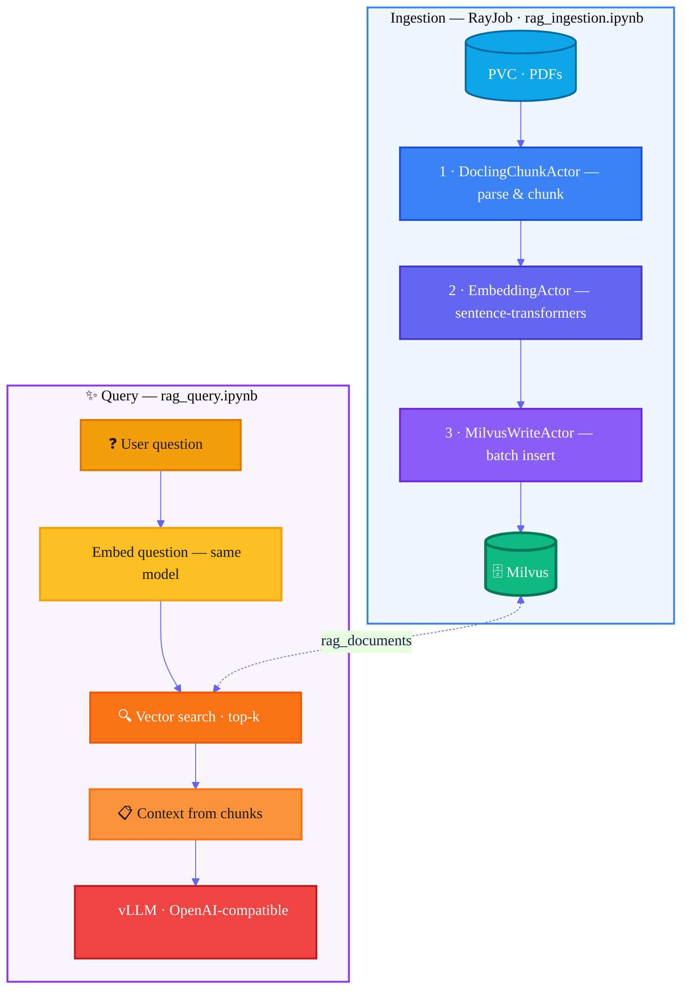
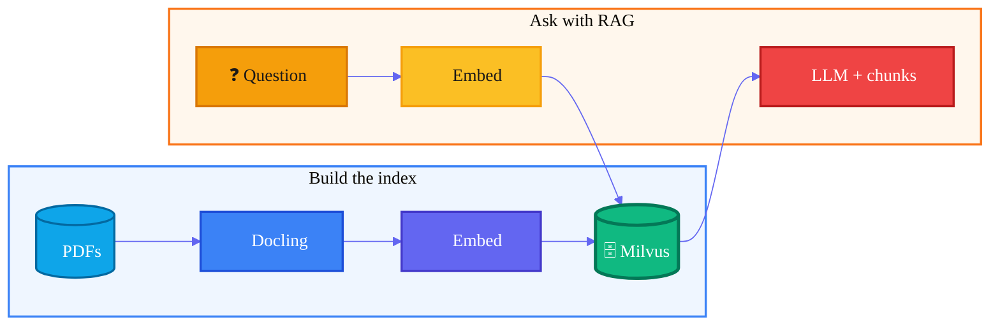

# RAG Document Ingestion with Ray Data

Ingest PDFs into a Milvus vector database for RAG using Ray Data, Docling,
and sentence-transformers. The pipeline runs as a RayJob on an existing
RayCluster on OpenShift.

## Architecture overview

High-level view for demos: **ingestion** builds the vector index on the cluster;
**query** runs from the notebook against Milvus and your inference endpoint.

Diagrams use **color-coded stages** (blue → violet pipeline, **emerald** Milvus, **amber** query path, **coral** LLM). They render on GitHub, GitLab, and [Mermaid Live](https://mermaid.live).

Ray Data **streams** the three stages: workers overlap (Docling is usually the
slowest). Optional **Logfire** spans and metrics cover pipeline actors and query
calls when `LOGFIRE_TOKEN` is set.

**Simplified one-slide version** (fewer boxes):

## Quick Start

1. Open `rag_ingestion.ipynb` in your RHOAI workbench
2. Run every cell top-to-bottom: configure, review the pipeline code,
   submit the RayJob, monitor, and validate

## Prerequisites

- Red Hat OpenShift AI with KubeRay operator
- Existing RayCluster (see `manifests/raycluster-rag-optimized.yaml`)
- ReadWriteMany PVC with input PDFs mounted on all Ray workers
- Milvus accessible from the Ray cluster
- CodeFlare SDK (`pip install codeflare-sdk`)

## Files

| File | Description |
|------|-------------|
| `rag_ingestion.ipynb` | Main notebook -- walks through the pipeline, then submits it |
| `docling_milvus_process.py` | RayJob entrypoint (3-stage Ray Data pipeline) |
| `manifests/raycluster-rag-optimized.yaml` | RayCluster spec (CPU workers) |
