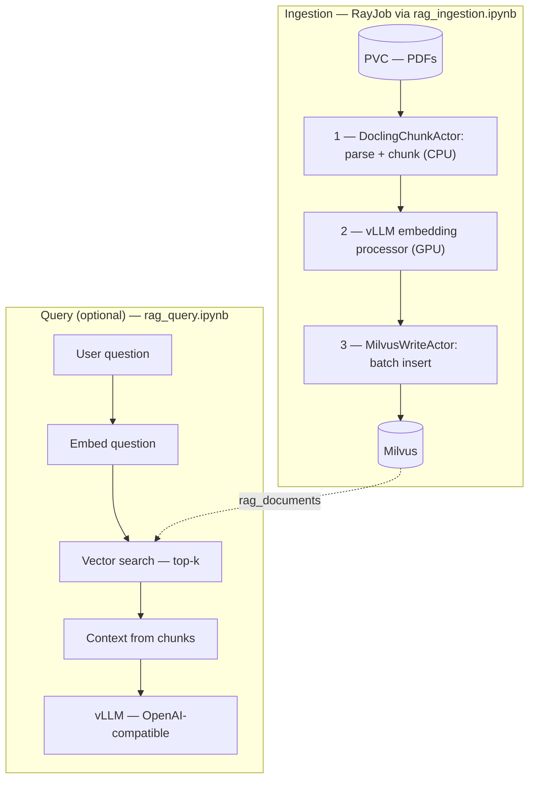
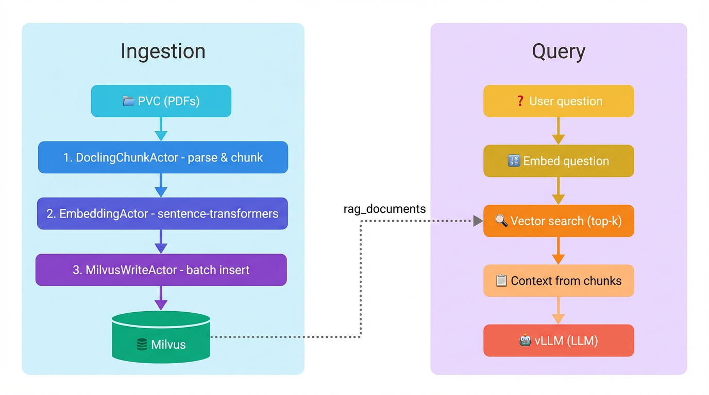

# RAG Ingestion with Ray Data, Docling, and vLLM

Build a distributed RAG ingestion pipeline on Red Hat OpenShift AI.
Parse PDFs with Docling, generate embeddings with vLLM (via Ray Data's
`vLLMEngineProcessorConfig`), and store vectors in Milvus — all running
as a RayJob on an existing RayCluster.

## Overview

This example demonstrates a production-style RAG ingestion workflow using
Ray Data's streaming execution engine. Three pipeline stages run in parallel
on a heterogeneous RayCluster (CPU + GPU workers), processing PDFs end-to-end
from raw files to searchable vector embeddings in Milvus.

Key technologies: **Ray Data**, **Docling** (PDF parsing + chunking),
**vLLM** (GPU-accelerated embedding), **Milvus** (vector database),
**CodeFlare SDK** (RayJob submission).

## Architecture



<details>
<summary>Diagram not rendering? View as image.</summary>


</details>

Ray Data **streams** the three ingestion stages so they overlap — Docling
(the slowest) does not block embedding from starting on completed chunks.

## Prerequisites

### Cluster

- **Red Hat OpenShift AI** with the **KubeRay operator** installed
- An existing **RayCluster** with CPU and GPU workers
  (see `manifests/raycluster-rag-optimized.yaml`)
- **Milvus** accessible from the Ray cluster (standalone or operator-managed)

### Runtime image

The RayCluster manifest and RayJob must use a container image that includes
Ray 2.54+, Docling, vLLM, and pymilvus. A ready-to-build Dockerfile is
available in the
[distributed-workloads](https://github.com/opendatahub-io/distributed-workloads/tree/main/images/runtime/examples/ray-data-rag)
repository:

```bash
cd images/runtime/examples/ray-data-rag
podman build -t quay.io/<you>/ray-data-rag:latest -f Dockerfile .
podman push quay.io/<you>/ray-data-rag:latest
```

Then update the `image:` fields in `manifests/raycluster-rag-optimized.yaml`
to point to your pushed image before applying.

### Storage

- A **ReadWriteMany (RWX)** PVC mounted on all Ray workers and the head node
- Input PDFs uploaded to the PVC (e.g. under `/mnt/data/input/pdfs`)

### Workbench

| Setting | Value |
| ------- | ----- |
| Image | Minimal Python 3.12 (no GPU required) |
| Memory | 4–8 Gi |
| CPU | 2 cores |

The workbench only submits the RayJob — all heavy processing happens on
the RayCluster.

## Hardware Requirements

| Resource | Specification |
| -------- | ---------------- |
| **GPU** | 1× NVIDIA T4 (16 GB) or A10G (24 GB) |
| **CPU workers** | 8 nodes × 4 CPUs × 16 Gi memory |
| **Head node** | 2 CPUs, 10 Gi memory |
| **Storage** | 50 Gi RWX PVC |
| **Milvus** | Standalone or operator-managed |

> [!NOTE]
> The RayCluster manifest (`manifests/raycluster-rag-optimized.yaml`) is
> sized for 8 CPU workers + 1 GPU worker. Scale worker counts up or down
> by editing `replicas` and adjusting `NUM_ACTORS` / `CPUS_PER_ACTOR` in
> the notebook to match.

## Files

| File | Description |
| ---- | ----------- |
| `rag_ingestion.ipynb` | Main notebook — configure, review pipeline, submit RayJob |
| `docling_milvus_process.py` | RayJob entrypoint (3-stage Ray Data pipeline) |
| `manifests/raycluster-rag-optimized.yaml` | RayCluster spec (CPU + GPU workers) |
| `rag_query.ipynb` | Optional query notebook — without-RAG vs with-RAG comparison |
| `rag_helpers.py` | Query-side helpers (keeps notebook cells short) |
| `fetch_sample_pdfs.sh` | Download all 1000 PDFs from the [Open RAG Benchmark](https://huggingface.co/datasets/deepmatics/open_ragbench) dataset |
| `.env.example` | Template for environment variables |

## Setup

1. **Build and push the runtime image** following the instructions in
   [Runtime image](#runtime-image) above.

2. **Update the RayCluster image** in `manifests/raycluster-rag-optimized.yaml`
   with your container image, then apply:

   ```bash
   oc apply -f manifests/raycluster-rag-optimized.yaml -n <namespace>
   ```

3. **Upload PDFs** to the RWX PVC. To download the full
   [Open RAG Benchmark](https://huggingface.co/datasets/deepmatics/open_ragbench)
   dataset (1000 arXiv PDFs, ~743 MB):

   ```bash
   ./fetch_sample_pdfs.sh
   oc cp sample_pdfs/ <head-pod>:/mnt/data/input/pdfs -n <namespace>
   ```

   Set `NUM_FILES` in the notebook to limit how many PDFs to process
   (0 = all).

## Usage

1. **Open `rag_ingestion.ipynb`** in your RHOAI workbench and run cells
   top-to-bottom:
   - Authenticate (`oc login`)
   - Configure cluster, PVC, Milvus, and vLLM embedding settings
   - Review the pipeline overview
   - Submit the RayJob
   - Monitor status and fetch logs

2. **Verify** the Milvus collection is populated (row count is printed in
   the job logs performance report and in the notebook's Verify cell).

3. **(Optional)** Open `rag_query.ipynb` to test retrieval quality — compare
   LLM answers without RAG vs with RAG.

## Expected Outcomes

After a successful ingestion run you should see:

- **Performance report** in the RayJob logs showing documents processed,
  total chunks, wall-clock time, throughput (chunks/sec, docs/sec), and
  per-stage timing breakdown (Docling parse, chunking, embedding, Milvus write).
- **Milvus row count** matching the total chunks reported — e.g. ~120,000
  vectors for 1000 PDFs at `CHUNK_MAX_TOKENS=256`.
- **`rag_query.ipynb`** returns cited answers from the ingested papers when
  queried with RAG, compared to generic/incorrect answers without RAG.

Typical performance on the reference hardware (8 CPU workers + 1 T4 GPU):

| Workload | Wall clock | Throughput |
| -------- | ---------- | ---------- |
| 50 PDFs | ~8 minutes | ~21 chunks/sec |
| 1000 PDFs | ~2.5 hours | ~21 chunks/sec |

## Configuration

All parameters are environment variables set in the ingestion notebook.

| Parameter | Default | Description |
| --------- | ------- | ----------- |
| `VLLM_MODEL_SOURCE` | `intfloat/multilingual-e5-large` | Embedding model for vLLM |
| `VLLM_BATCH_SIZE` | 4 | Batch size for embedding processor |
| `VLLM_CONCURRENCY` | 1 | GPU workers for embedding |
| `VLLM_ENGINE_KWARGS_JSON` | `{}` | vLLM engine args (JSON); set for your GPU |
| `EMBEDDING_DIM` | 1024 | Vector dimension (must match model) |
| `NUM_ACTORS` | 8 | Docling parsing actors (CPU-heavy) |
| `CPUS_PER_ACTOR` | 4 | CPUs per Docling actor |
| `NUM_MILVUS_ACTORS` | 2 | Milvus write actors (I/O-bound) |
| `NUM_FILES` | 0 | PDFs to process (0 = all) |
| `BATCH_SIZE` | 2 | PDFs per Docling actor batch |
| `CHUNK_MAX_TOKENS` | 256 | Max tokens per chunk |
| `MILVUS_BATCH_SIZE` | 64 | Vectors per Milvus insert batch |

## Observability

The **Ray Dashboard** is exposed on port 8265 of the head node. To access it:

```bash
oc port-forward svc/raytest-head-svc 8265:8265 -n <namespace>
# Open http://localhost:8265
```

Useful views while the job runs:

- **Jobs** — submission status, logs, duration
- **Actors** — live DoclingChunkActor / MilvusWriteActor instances and their state
- **Metrics** — CPU, GPU, and object store utilization across workers

## Troubleshooting

### RayJob not starting

```bash
oc get rayjob <job-name> -n <namespace> -o yaml
oc get pods -l ray.io/cluster=<cluster-name> -n <namespace>
```

### PVC access errors

Verify the PVC has `ReadWriteMany` access mode:

```bash
oc get pvc <pvc-name> -n <namespace> -o jsonpath='{.spec.accessModes}'
```

### Milvus connection refused

Check that the Milvus service is reachable from the Ray cluster:

```bash
oc exec -it <head-pod> -n <namespace> -- curl -s http://<milvus-host>:<port>/v1/vector/collections
```

### vLLM GPU out-of-memory

On smaller GPUs (e.g. Tesla T4, 16 GB), CUDA graph capture can exhaust VRAM.
Set `VLLM_ENGINE_KWARGS_JSON={"enforce_eager": true, "gpu_memory_utilization": 0.8}`
in the ingestion notebook to disable graph capture and reduce memory usage.

### Actor memory errors

Reduce `NUM_ACTORS` or increase worker memory in the RayCluster spec.
Large/complex PDFs can require 2–4 Gi per Docling actor.

### CodeFlare SDK secret size exceeded

If the RayJob submission fails with "Secret size exceeds 1MB limit", ensure
the notebook's `working_dir` points to a minimal directory containing only
`docling_milvus_process.py` (the notebook handles this automatically).

## Related examples

- **[Distributed PDF Processing with Docling](../../docling/)** — batch
  PDF-to-JSON/Markdown conversion without the RAG stack
