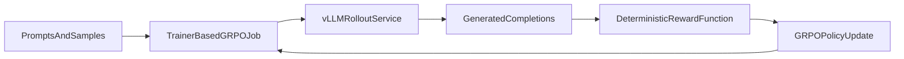

# GRPO with Kubeflow Trainer on Red Hat OpenShift AI

This example set demonstrates a practical path for running GRPO-style
post-training on Red Hat OpenShift AI with Kubeflow Trainer and an optional
external `vLLM` rollout service.

The examples are intentionally split into two parts:

1. **GRPO with Trainer** — validate that `TRL GRPOTrainer` runs correctly on
   the existing Trainer runtime and cluster GPU topology.
2. **Trainer + vLLM rollout path** — validate the serving boundary needed when
   rollout generation is externalized to `vLLM`.

## Overview

GRPO is an online post-training method. Each training step requires the model
to:

- generate completions
- score them with a reward function
- update the policy based on relative reward

This makes GRPO a good fit for platform validation because it exercises both:

- distributed training behavior through Kubeflow Trainer
- rollout generation architecture, which often leads to `vLLM`

## Workflow

The two notebooks in this folder validate the two major parts of this flow:

- the **Trainer-based GRPO loop**
- the **external `vLLM` rollout service boundary**

## Notebooks

| Notebook | Purpose |
| --- | --- |
| [grpo-trainer-example.ipynb](./grpo-trainer-example.ipynb) | Run a public GSM8K-based GRPO workload on Kubeflow Trainer using `TRL GRPOTrainer` |
| [grpo-vllm-rollout-example.ipynb](./grpo-vllm-rollout-example.ipynb) | Deploy and validate an external `vLLM` rollout service and test the OpenAI-compatible inference path |

## Requirements

### OpenShift AI cluster

* Red Hat OpenShift AI (RHOAI) 3.3+ with:
  * `trainer` component enabled
  * `workbenches` component enabled
* NVIDIA GPU nodes for realistic GRPO validation

### Cluster runtime assumptions

These notebooks assume the cluster already exposes a Trainer runtime suitable
for distributed PyTorch jobs, such as:

* `torch-distributed`
* `torch-distributed-cuda130-torch291-py312`

The notebooks use public model and dataset assets and do not require internal
Training Hub packaging.

### Hardware guidance

#### GRPO Trainer example

| Scenario | Suggested configuration |
| --- | --- |
| Single node, single GPU | 1 node x 1 GPU |
| Single node, multi GPU | 1 node x 2 GPUs |
| Multi node, multi GPU | 2 nodes x 2 GPUs |

#### vLLM rollout example

| Scenario | Suggested configuration |
| --- | --- |
| Single node rollout service | 1 node x 1 GPU |
| Tensor-parallel rollout service | 1 node x 2+ GPUs |

## Authentication

The notebooks expect:

* `OPENSHIFT_API_URL`
* `NOTEBOOK_USER_TOKEN`

These are commonly set automatically in OpenShift AI workbenches.

## What these examples demonstrate

### GRPO with Trainer

The GRPO notebook demonstrates:

- `TrainerClient` connectivity
- runtime discovery
- `CustomTrainer` submission
- TRL-based GRPO training on the GSM8K dataset
- distributed environment validation through:
  - `RANK`
  - `WORLD_SIZE`
  - `MASTER_ADDR`
  - `MASTER_PORT`
  - `LOCAL_RANK`

### `vLLM` rollout path

The `vLLM` notebook demonstrates:

- deploying a namespace-scoped `vLLM` service
- validating `vLLM` health and OpenAI-compatible API behavior
- testing the rollout-service boundary that a Trainer-based GRPO flow would call
- validating the rollout control-plane endpoints required before any later
  weight-sync work

This second notebook is a rollout-path example, not a full native weight-sync
automation example.

## Recommended execution order

1. Run [grpo-trainer-example.ipynb](./grpo-trainer-example.ipynb)
2. Confirm the Trainer-backed GRPO path works in the selected topology
3. Run [grpo-vllm-rollout-example.ipynb](./grpo-vllm-rollout-example.ipynb)
4. Validate the `vLLM` rollout boundary and API path

## Expected outputs

After running the notebooks, you should have:

- a concrete GRPO-on-Trainer validation result
- a concrete `vLLM` rollout validation result
- enough evidence to reason about:
  - scaling from single-GPU to multi-node setups
  - whether `vLLM` should remain external
  - what gaps remain for rollout-weight synchronization
