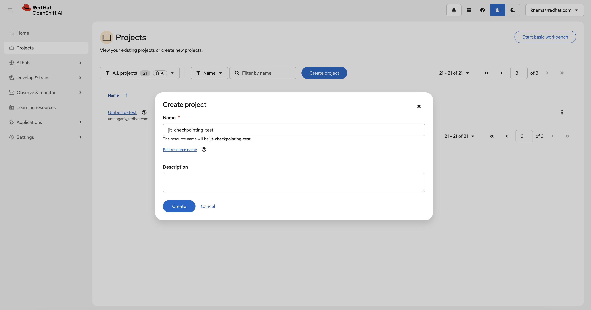
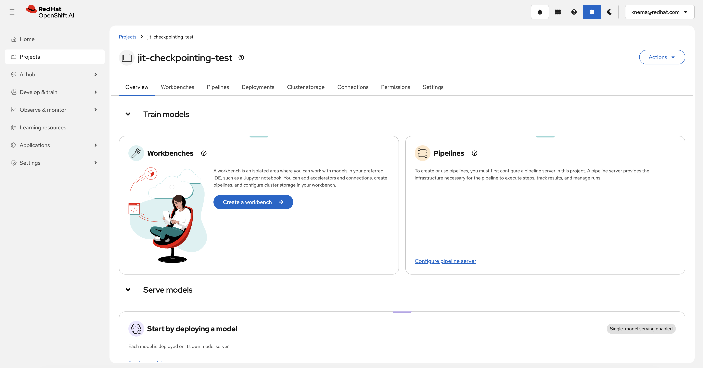
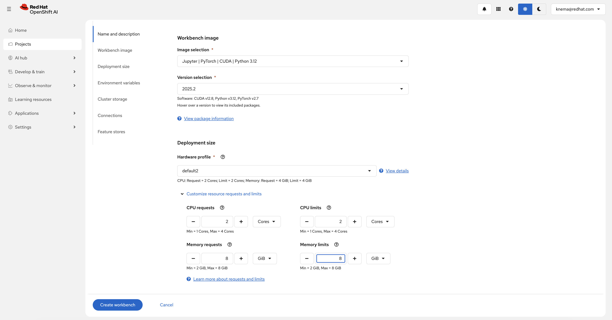
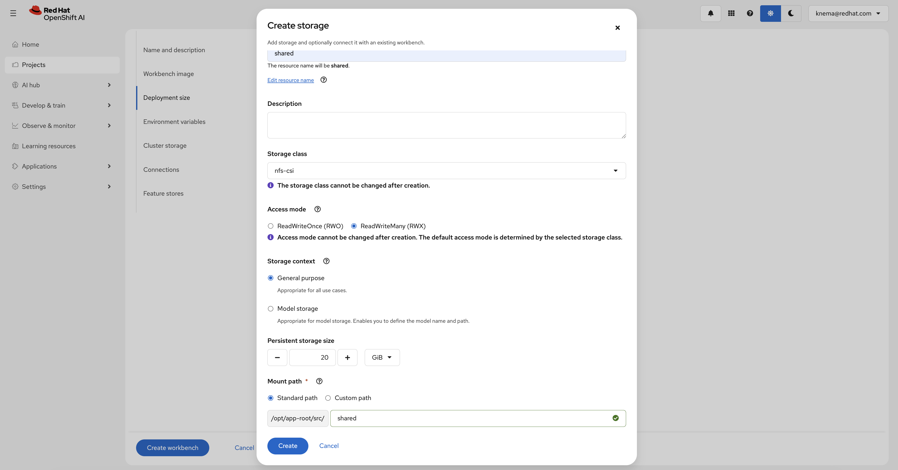
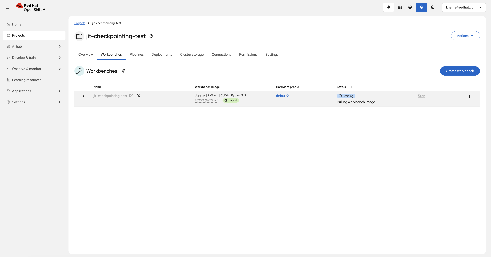
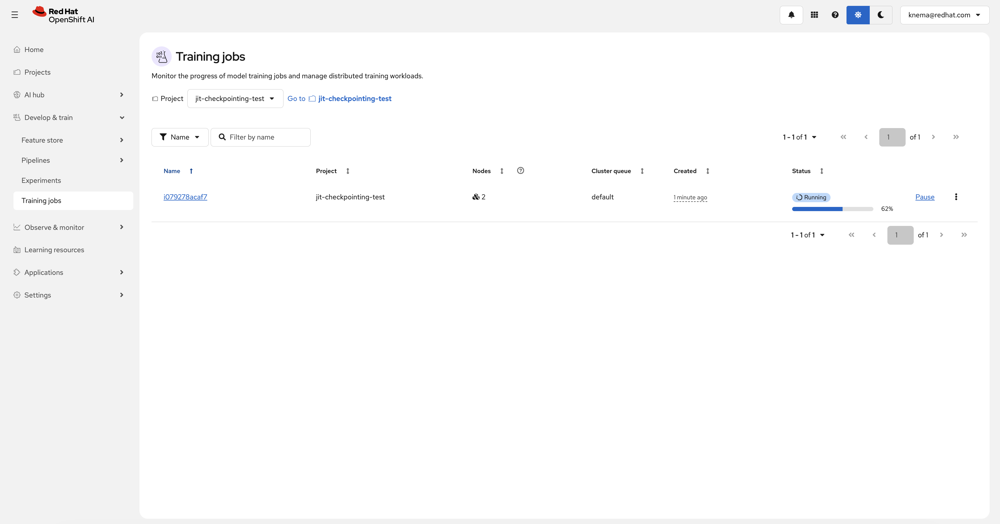
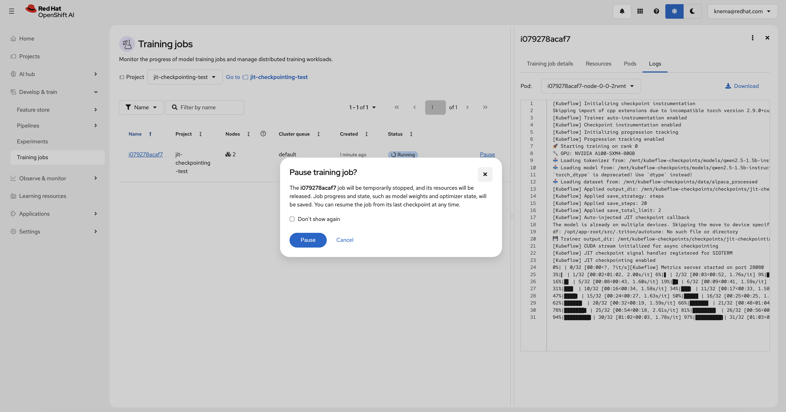
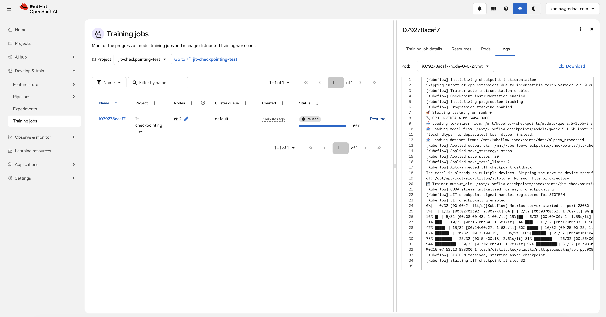
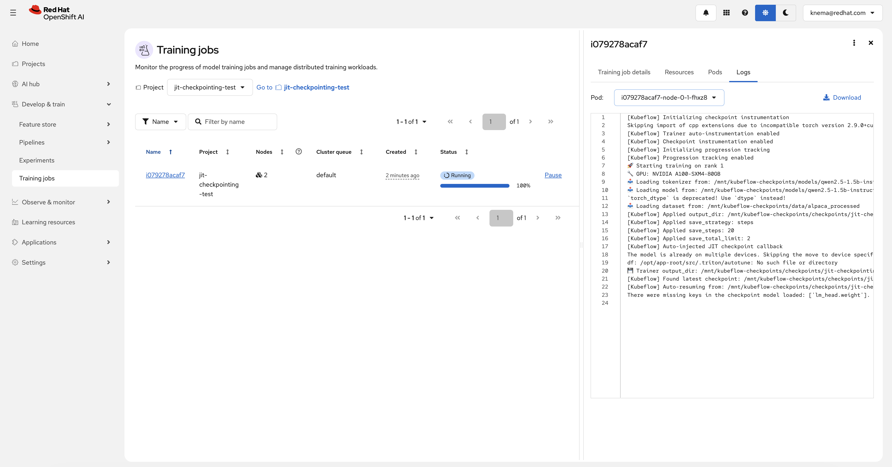

# JIT Checkpointing with TransformersTrainer on Red Hat OpenShift AI

This example demonstrates how to use `TransformersTrainer` with **Just-In-Time (JIT) checkpointing** to run preemption-safe distributed fine-tuning of Hugging Face models on Red Hat OpenShift AI.

## Overview

`TransformersTrainer` is a specialized trainer that extends the Kubeflow `CustomTrainer` with:

* **JIT Checkpointing** — Automatically save training state on SIGTERM (preemption-safe)
* **Periodic Checkpointing** — Configure regular checkpoint saves using `PeriodicCheckpointConfig`
* **Auto-Resume** — Automatically resume training from the latest checkpoint on restart
* **Automatic progress tracking** — Real-time visibility into training steps, epochs, loss, and ETA

This example fine-tunes **Qwen 2.5 1.5B Instruct** on the **Stanford Alpaca** dataset and demonstrates how to configure JIT checkpointing for resilient training in preemptible environments.

## Why JIT Checkpointing?

In cloud and Kubernetes environments, training pods can be preempted or terminated for various reasons:

| Scenario | Description |
| --- | --- |
| **Spot/Preemptible instances** | Cost-effective but can be reclaimed anytime |
| **Kueue preemption** | Higher-priority workloads may preempt lower-priority jobs |
| **Node maintenance** | Cluster upgrades or node drains |
| **Resource pressure** | Pods evicted due to memory or resource limits |

JIT checkpointing ensures that when a pod receives SIGTERM:

1. Training pauses safely after the current optimizer step
2. Model state, optimizer state, and training progress are saved
3. When the job restarts, training automatically resumes from the checkpoint

## Requirements

### OpenShift AI cluster

* Red Hat OpenShift AI (RHOAI) 3.2+ with:
  * `trainer` component enabled
  * `workbenches` component enabled

### Hardware requirements

#### Training job

| Component | Configuration | Notes |
| --- | --- | --- |
| Training pods | 2 nodes x 1 GPU | Configurable in notebook |
| GPU type | NVIDIA A100/L40/T4 or equivalent | Any CUDA-compatible GPU |
| Memory | 16Gi per pod | Adjust based on model size |

#### Workbench

| Image | GPU | CPU | Memory | Notes |
| --- | --- | --- | --- | --- |
| Minimal Python 3.12 | Optional | 2 cores | 8Gi | GPU recommended for faster testing |

#### Storage

| Purpose | Size | Access mode | Notes |
| --- | --- | --- | --- |
| Shared PVC | 20Gi+ | ReadWriteMany (RWX) | Required for multi-node training and persisting model/data/checkpoints |

## Environment variables

The notebook uses these environment variables for API authentication:

* `OPENSHIFT_API_URL` — your OpenShift API URL
* `NOTEBOOK_USER_TOKEN` — a token for API access

These are often auto-set in OpenShift AI workbenches.

## PVC mount paths (workbench vs training pods)

The notebook uses two different mount conventions:

* **Workbench mount (user-configured)**: when you attach a PVC named (for example) `shared` to the workbench, it is typically mounted at `/opt/app-root/src/<pvc-name>` (e.g. `/opt/app-root/src/shared`).
* **Training pod mount (SDK, fixed)**: when you use `TransformersTrainer(output_dir="pvc://<pvc-name>/<path>")`, the SDK mounts that PVC at `/mnt/kubeflow-checkpoints` inside the training pods.

## Setup

### 1. Access OpenShift AI Dashboard

Access the OpenShift AI dashboard from the top navigation bar menu.

### 2. Create a Data Science Project

Log in, then go to **Data Science Projects** and create a project:



Once created, you'll see your project dashboard:



### 3. Create a Workbench

Once the project is created, click on **Create a workbench** and configure with the following settings:



> [!NOTE]
> Adding an accelerator is optional - only needed to test fine-tuned models from within the workbench.

### 4. Create Shared Storage (Required)

Create a storage with RWX access (for example, a PVC named `shared`):



### 5. Start the Workbench

From the "Workbenches" page, click on **Open** when your workbench is ready:



### 6. Clone the Repository

From your workbench, clone this repository:

```bash
git clone https://github.com/red-hat-data-services/red-hat-ai-examples.git
```

Navigate to `examples/trainer/jit-checkpointing` and open the notebook.

## Running the example

The notebook walks you through:

1. **Installing dependencies** — Kubeflow SDK and required packages
2. **Configuring authentication and paths** — API access + PVC mount paths
3. **Staging model and dataset to the PVC** — Download Qwen 2.5 + Alpaca subset from the workbench
4. **Defining the training function** — A `transformers.Trainer` loop that loads inputs from the PVC
5. **Configuring JIT checkpointing + submitting TransformersTrainer** — Enable preemption-safe training
6. **Verifying checkpoints** — Check checkpoint structure on PVC
7. **Testing the model** — Load and test the fine-tuned model
8. **Cleanup** — Deleting the training job

## Key Features Demonstrated

### JIT Checkpointing

Enable JIT checkpointing to automatically save training state on SIGTERM:

```python
trainer = TransformersTrainer(
    func=train_func,
    num_nodes=2,
    resources_per_node={"nvidia.com/gpu": 1, "cpu": "4", "memory": "16Gi"},
    enable_jit_checkpoint=True,  # Save checkpoint on SIGTERM
    output_dir="pvc://shared/checkpoints/jit-checkpointing",
)
```

When `enable_jit_checkpoint=True`:

1. **SIGTERM Handler Registered** — TransformersTrainer registers a signal handler
2. **Safe Checkpoint** — Training pauses after the current optimizer step
3. **Async Save** — Model state is saved asynchronously using CUDA streams
4. **Sentinel File** — Ensures incomplete checkpoints are detected and cleaned up
5. **Auto-Resume** — On restart, training resumes from the latest valid checkpoint

### Periodic Checkpointing

Configure regular checkpoint saves using `PeriodicCheckpointConfig`:

```python
from kubeflow.trainer.rhai.transformers import PeriodicCheckpointConfig

checkpoint_config = PeriodicCheckpointConfig(
    save_strategy="steps",    # or "epoch"
    save_steps=20,            # Save every 20 steps
    save_total_limit=2,       # Keep only 2 most recent checkpoints
)

trainer = TransformersTrainer(
    func=train_func,
    periodic_checkpoint_config=checkpoint_config,
    ...
)
```

> **Note:** Periodic checkpointing blocks GPU training during the save operation. Avoid checkpointing too frequently (e.g., every step) as this can significantly increase total training time and waste GPU cycles.

### Viewing Training Jobs

View your training job status in the OpenShift AI Dashboard:



### Pausing and Resuming Training (JIT Checkpoint Demo)

You can pause a running training job to demonstrate JIT checkpointing. When paused, the pod receives SIGTERM and saves a checkpoint:

**Pause the training job:**



**Job paused - checkpoint saved:**



**Resume training - auto-resumes from checkpoint:**



### Checkpoint Structure

The training function saves checkpoints with this structure:

```text
/opt/app-root/src/shared/checkpoints/jit-checkpointing/
├── checkpoint-<step>/  # Intermediate checkpoints (saved every save_steps)
├── checkpoint-<N>/     # Checkpoint at final step (N = last step number)
└── final/              # Final merged model ready for inference
```

## Customization

You can modify the example for your use case:

| Parameter | Default | Description |
| --- | --- | --- |
| `num_nodes` | 2 | Number of training nodes |
| `resources_per_node` | 1 GPU | GPUs per node |
| Model | `Qwen/Qwen2.5-1.5B-Instruct` | Any Hugging Face model |
| Dataset | `tatsu-lab/alpaca` | Any Hugging Face dataset repo |
| `num_train_epochs` | 5 | Training epochs (allows time for pause/resume testing) |
| `enable_jit_checkpoint` | `True` | Enable JIT checkpointing |
| `save_steps` | 20 | Checkpoint frequency |
| `save_total_limit` | 2 | Max checkpoints to keep |
| PVC | `shared` | Update `PVC_NAME` in the notebook if you use a different PVC name |

## Troubleshooting

### Job not starting

```bash
# Check TrainJob status
oc get trainjob <job-name> -o yaml

# Check for pending pods
oc get pods -l trainer.kubeflow.org/train-job-name=<job-name>
```

### JIT checkpointing not working

Verify the logs show JIT checkpoint initialization:

```bash
oc logs <pod-name> -c node | grep -i "JIT"
```

Expected output:

```text
[Kubeflow] JIT checkpoint signal handler registered for SIGTERM
[Kubeflow] JIT checkpointing enabled
```

### Checkpoints not appearing

1. Verify the PVC is mounted correctly:

   ```bash
   oc exec <pod-name> -c node -- ls -la /mnt/kubeflow-checkpoints/
   ```

2. Check if the output_dir is set correctly in the trainer logs:

   ```bash
   oc logs <pod-name> -c node | grep "output_dir"
   ```

### Auto-resume not working

Verify checkpoints exist and are valid (no sentinel files):

```bash
ls -la /opt/app-root/src/shared/checkpoints/jit-checkpointing/
```

If you see files named `checkpoint-is-incomplete.txt`, those checkpoints are invalid and will be cleaned up automatically on resume.

## When to Use JIT Checkpointing

| Scenario | Recommendation |
| --- | --- |
| Spot/Preemptible instances | **Enable** - Instances can be reclaimed anytime |
| Kueue-managed workloads | **Enable** - Higher-priority jobs may preempt |
| Long-running training | **Enable** - Protect against interruptions |
| Short training runs | Optional - May add small overhead |
