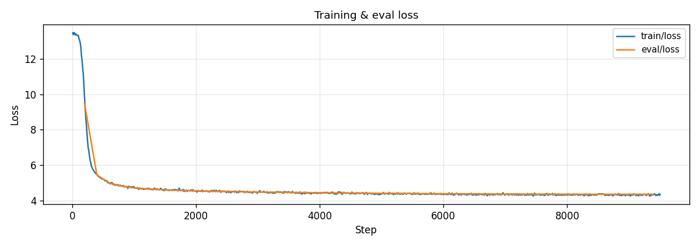
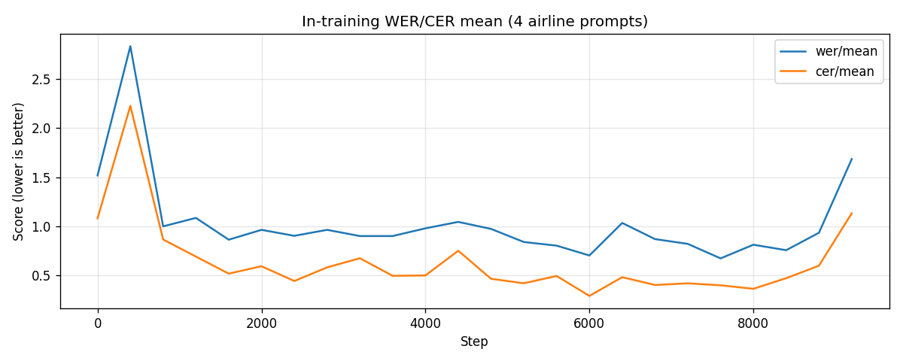
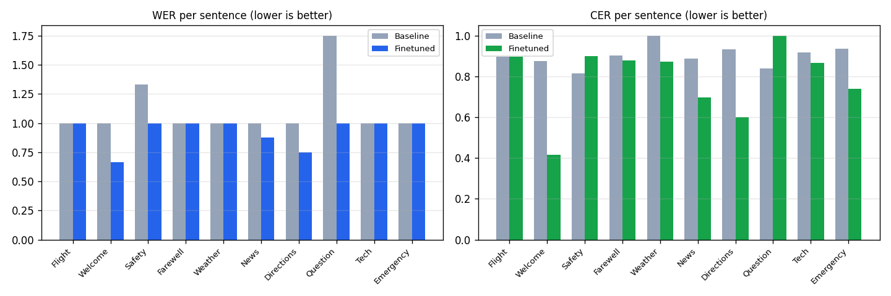

# Orpheus Turkish TTS Fine-Tuning with LoRA

Fine-tune [Orpheus-3B](https://huggingface.co/unsloth/orpheus-3b-0.1-pretrained) for **Turkish text-to-speech** using LoRA and the Kubeflow Trainer v2 `TransformersTrainer` SDK on Red Hat OpenShift AI.

## Overview

Orpheus-3B is a 3.3B-parameter codec language model built on Llama-3 that generates speech as discrete SNAC audio tokens. By default it only supports English. This example fine-tunes it on Turkish text-audio pairs so it produces intelligible Turkish speech.

The example demonstrates:

- **SNAC audio codec preprocessing** -- encoding raw audio into interleaved codec token sequences
- **LoRA fine-tuning** via `TransformersTrainer` -- distributed across multiple nodes with PyTorch DDP
- **Audio-only loss masking** -- cross-entropy computed only on audio token positions
- **Post-training inference** -- generating Turkish speech and decoding SNAC tokens back to waveforms

### How it works

```text
Turkish text
      |
      v
 Llama-3 Tokenizer
      |
      v
 Orpheus-3B (3.3B params, LoRA r=16)
      |
      v
 Token stream: [SOH] text [EOT][EOH][SOA][SOS] audio_tokens [EOA]
      |
      v
 SNAC Decoder (24kHz)
      |
      v
 Audio waveform
```

Each training sample interleaves text BPE tokens with SNAC codec tokens (7 per audio frame across 3 codebooks). The model learns to generate audio conditioned on text input, with text positions masked from the loss.

### Model and dataset

| Component | Details |
|-----------|---------|
| **Base model** | [unsloth/orpheus-3b-0.1-pretrained](https://huggingface.co/unsloth/orpheus-3b-0.1-pretrained) (3.3B, Llama-3 backbone) |
| **Audio codec** | [hubertsiuzdak/snac_24khz](https://huggingface.co/hubertsiuzdak/snac_24khz) |
| **Dataset** | [afkfatih/turkish-tts-combined-raw](https://huggingface.co/datasets/afkfatih/turkish-tts-combined-raw) (~81K text-audio pairs) |
| **Fine-tuning method** | LoRA (r=16, alpha=32) on attention + MLP projections |

## Prerequisites

- OpenShift AI (RHOAI) 3.2+ with Kubeflow Trainer v2 enabled
- A workbench with **GPU** (required for LoRA merge and inference)
- GPU worker nodes for distributed training (A100 recommended)
- A shared PVC with **ReadWriteMany (RWX)** access mode
  - **Suggested size**: 150Gi (base model ~7GB, SNAC model ~200MB, preprocessed dataset, checkpoints)

## Hardware requirements

### Workbench requirements

| Image Type | GPU | CPU | Memory | Notes |
|------------|-----|-----|--------|-------|
| Training \| Jupyter \| PyTorch \| CUDA \| Python | 1x GPU | 4 cores | 32Gi | Required for LoRA merge and post-training inference |

### Training job requirements

| Component | Configuration | GPU per node | Total GPU | CPU | Memory |
|-----------|--------------|---|---|-----|--------|
| Training pods | 2 nodes x 1 GPU | 1 | 2 | 4 cores/pod | 32Gi/pod |

> **Note:** This example was tested on 2 x A100-80GB. It will work on other Ampere+ GPUs (L40S, H100) with adjusted batch size. For GPUs with less than 40GB VRAM, reduce `BATCH_SIZE` to 1 or increase `GRAD_ACCUM`.

### Storage requirements

| Purpose | Size | Access Mode | Notes |
|---------|------|-------------|-------|
| Shared PVC | 150Gi | RWX | Base model, SNAC model, preprocessed data, checkpoints |

## Setup

### Create a workbench

1. In the OpenShift AI dashboard, go to **Data Science Projects** and create or select a project.
2. Create a workbench with the **Training | Jupyter | PyTorch | CUDA | Python** image.
3. Attach a GPU hardware profile (1x GPU minimum).
4. Create a shared **RWX PVC** (150Gi recommended) and attach it to the workbench.

### Clone and open the notebook

From the workbench terminal:

```bash
git clone https://github.com/red-hat-data-services/red-hat-ai-examples.git
```

Navigate to `examples/trainer/orpheus-tts` and open `orpheus_tts_distributed.ipynb`.

## Usage

The notebook walks you through the full workflow:

1. **Install dependencies** -- Kubeflow SDK
2. **Configure authentication and paths** -- API access, PVC mounts, hyperparameters, MLflow
3. **Define the training function** -- Wraps `train_orpheus.py` which handles SNAC preprocessing (rank 0), LoRA fine-tuning, and MLflow tracking
4. **Submit distributed training** -- `TransformersTrainer` with DDP across 2 nodes, periodic + JIT checkpointing, and real-time progression tracking
5. **Monitor training** -- Stream logs, check progress in the OpenShift AI Dashboard (step, loss, ETA)
6. **Merge LoRA adapter** -- Combine adapter weights into standalone model
7. **Generate Turkish speech** -- Run inference and listen to audio output
8. **Cleanup** -- Delete the training job

## Expected outcomes

After training completes:

- A merged model at `<PVC>/orpheus-tts/final/` capable of generating Turkish speech
- Training checkpoints at `<PVC>/orpheus-tts/checkpoints/`
- Generated audio samples playable in the notebook

With 2,000 training samples and 3 epochs, expect noticeably improved Turkish intelligibility compared to the English-only pretrained model. For production quality, increase `MAX_SAMPLES` to 20,000+ and `NUM_EPOCHS` to 8.

### Reference results (20K samples, 8 epochs, 2× A100-80GB)

Post-training evaluation comparing English-only base against the fine-tuned Turkish model, scored with Whisper-small ASR:

| Metric | Baseline | Fine-tuned | Δ |
|--------|----------|------------|---|
| **WER mean** | 1.576 | **0.723** | −0.854 |
| **CER mean** | 1.224 | **0.410** | −0.814 |
| **eval_loss** | 9.50 | **4.35** | −5.15 |



**In-training WER/CER** — measured on 4 Turkish sentences every 400 steps:



**Full MLflow dashboard** — loss, WER/CER, and per-sentence CER improvement:


**Per-sentence WER & CER** — baseline (grey) vs fine-tuned (blue/green):



See the [HuggingFace model card](https://huggingface.co/AbDhumal/orpheus-3b-turkish-tts-v2) for audio samples and MLflow traces.

## Customization

| Parameter | Default | Description |
|-----------|---------|-------------|
| `MAX_SAMPLES` | 2000 | Training samples (0 = full ~81K dataset) |
| `NUM_NODES` | 2 | Distributed training nodes |
| `GPUS_PER_NODE` | 1 | GPUs per training node |
| `BATCH_SIZE` | 4 | Per-device batch size (gradient checkpointing enables larger batches) |
| `GRAD_ACCUM` | 2 | Gradient accumulation steps |
| `NUM_EPOCHS` | 3 | Training epochs |
| `LEARNING_RATE` | 2e-5 | AdamW learning rate |
| `LORA_R` | 16 | LoRA rank (production run used 32) |
| `LORA_ALPHA` | 32 | LoRA alpha (production run used 64) |

## Troubleshooting

### SNAC preprocessing is slow

SNAC encoding runs on GPU inside the TrainJob (rank 0). For large datasets (>10K samples), the first run may take 15-30 minutes. Subsequent runs skip preprocessing if the `.done` sentinel exists on the PVC.

### Out of memory during training

Reduce `BATCH_SIZE` to 1 and increase `GRAD_ACCUM` to maintain the same effective batch size. Alternatively, use GPUs with more VRAM.

### NCCL errors

```bash
oc logs <pod-name> -c node | grep -i "nccl"
```

Ensure all training nodes can communicate on the required ports. Add `NCCL_DEBUG=INFO` to the trainer `env` dict for diagnostics.

### Generated audio is silent or garbled

- Verify the preprocessed dataset has the `.done` sentinel file on PVC
- Check that the SNAC model was downloaded correctly
- Ensure the base model is `unsloth/orpheus-3b-0.1-pretrained` (Llama-3 vocab, not Llama-2)

## References

- [Orpheus-TTS](https://github.com/canopyai/Orpheus-TTS) -- Lacombe & Kumar, 2025
- [SNAC: Multi-Scale Neural Audio Codec](https://github.com/hubertsiuzdak/snac) -- Siuzdak, 2024
- [Kubeflow Trainer v2](https://github.com/kubeflow/trainer) -- TrainJob API
- [PEFT: Parameter-Efficient Fine-Tuning](https://github.com/huggingface/peft) -- HuggingFace
