# S3 Checkpoint Storage with TransformersTrainer on Red Hat OpenShift AI

This example demonstrates how to use `TransformersTrainer` with **S3 checkpoint storage** to run scalable, durable distributed fine-tuning of Hugging Face models on Red Hat OpenShift AI.

## Overview

`TransformersTrainer` is a specialized trainer that extends the Kubeflow `CustomTrainer` with:

* **S3 Checkpoint Storage** — Upload/download checkpoints to S3-compatible object storage (AWS S3, MinIO, etc.)
* **JIT Checkpointing** — Automatically save training state on SIGTERM (preemption-safe)
* **Periodic Checkpointing** — Configure regular checkpoint saves using `PeriodicCheckpointConfig`
* **Auto-Resume** — Automatically resume training from the latest checkpoint in S3 on restart
* **Automatic progress tracking** — Real-time visibility into training steps, epochs, loss, and ETA

This example fine-tunes **Qwen 2.5 1.5B Instruct** on the **Stanford Alpaca** dataset and demonstrates how to configure S3 storage for resilient, scalable checkpoint management.

## Why S3 for Checkpoint Storage?

S3-compatible object storage offers several advantages for distributed training:

| Benefit | Description |
| --- | --- |
| **Scalability** | No storage size limits, pay only for what you use |
| **Durability** | Built-in replication and high availability |
| **Accessibility** | Access checkpoints from anywhere, share across clusters and regions |
| **Cost-Effective** | Object storage is typically cheaper than block storage for large checkpoints |
| **Preemption Safety** | JIT checkpointing ensures training state is saved when pods receive SIGTERM |

### Common Scenarios for S3 Checkpoint Storage

| Scenario | Description |
| --- | --- |
| **Large model checkpoints** | Models >10GB benefit from unlimited S3 storage vs fixed PVC size |
| **Long-running training** | Unlimited storage without worrying about PVC capacity |
| **Cross-cluster training** | Share checkpoints across different clusters or regions |
| **Spot/Preemptible instances** | Training on cost-effective but reclaimable instances |
| **Kueue preemption** | Higher-priority workloads may preempt lower-priority jobs |
| **Multi-team collaboration** | Teams can access checkpoints from central S3 storage |

## Requirements

### OpenShift AI cluster

* Red Hat OpenShift AI (RHOAI) 3.4 EA2+ with:
  * `trainer` component enabled
  * `workbenches` component enabled

### S3-Compatible Storage

* AWS S3, MinIO, or any S3-compatible object storage
* S3 bucket created and accessible
* S3 credentials (Access Key ID and Secret Access Key) with **read and write permissions** to the bucket or specific path where checkpoints will be stored

### Hardware requirements

#### Training job

| Component | Configuration | Notes |
| --- | --- | --- |
| Training pods | 2 nodes x 1 GPU | Configurable in notebook |
| GPU type | NVIDIA A100/L40/T4 or equivalent | Any CUDA-compatible GPU |
| CPU | 4 cores per pod | Adjust based on workload |
| Memory | 16Gi per pod | Adjust based on model size |

#### Workbench

| Image | GPU | CPU | Memory | Notes |
| --- | --- | --- | --- | --- |
| Minimal Python 3.12 | Optional | 2 cores | 8Gi | GPU recommended for testing trained models |

#### Storage

| Purpose | Size | Access mode | Notes |
| --- | --- | --- | --- |
| Shared PVC (for model/data) | 20Gi+ | ReadWriteMany (RWX) or ReadWriteOnce (RWO) | Used for pre-downloading model and dataset, NOT for checkpoints |
| S3 Bucket | Unlimited | N/A | Checkpoints are saved to S3, not PVC |
| Node ephemeral storage | Sufficient for model + checkpoints | N/A | Each training node needs enough local storage for temporary checkpoint files before S3 upload |

> **Note:** Unlike PVC checkpointing, this example stores checkpoints in S3 object storage. The shared PVC is only used for caching the model and dataset so training pods can access them offline.

**Important - Node Storage:** Training pods require sufficient node ephemeral storage for:

* Temporary checkpoint files (before upload to S3)
* Model loading and intermediate computation

For this example (Qwen 2.5 1.5B), default node storage is sufficient. If you modify the notebook to use larger models or datasets, ensure your cluster nodes have adequate ephemeral storage capacity. A good rule of thumb is 2-3x the model size for safe operation.

## Environment variables

The notebook uses these environment variables for API authentication:

* `OPENSHIFT_API_URL` — your OpenShift API URL
* `NOTEBOOK_USER_TOKEN` — a token for API access

These are often auto-set in OpenShift AI workbenches.

## Setup

### 1. Access OpenShift AI Dashboard

Access the OpenShift AI dashboard from the top navigation bar menu.

### 2. Create a Data Science Project

Log in, then go to **Data Science Projects** and create a project:

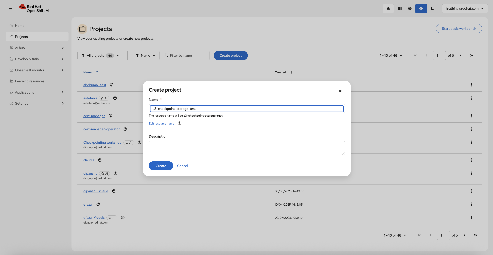

Once created, you'll see your project dashboard:

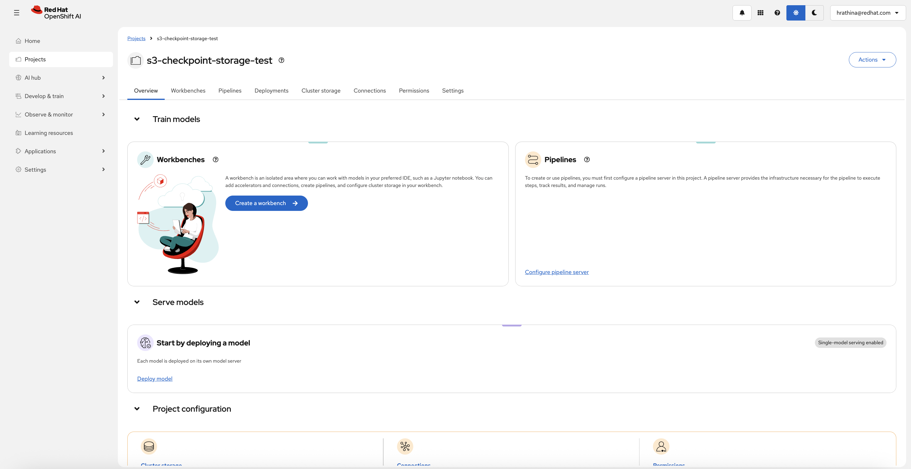

### 3. Create S3 Data Connection

Before running the training job, you must create an S3 Data Connection to securely manage S3 credentials.

#### Navigate to Connections

From your project dashboard, click on the **Connections** tab:

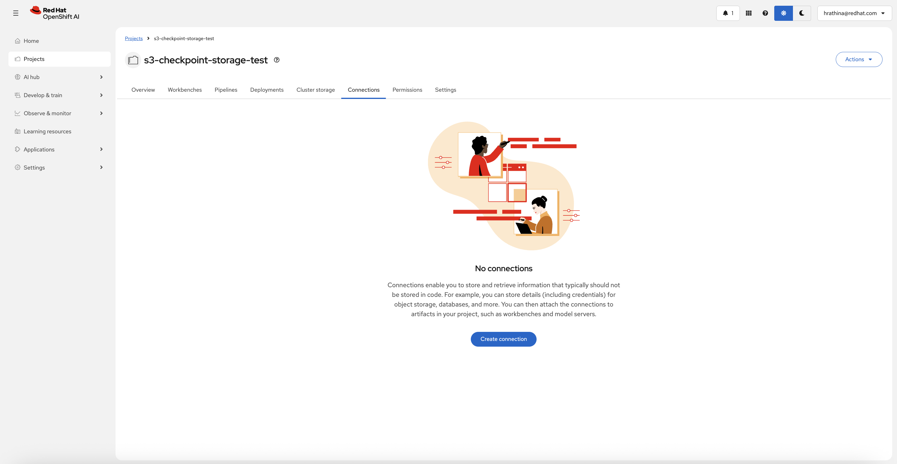

#### Create Connection

Click **Create connection** button and select **S3 compatible object storage - v1**:

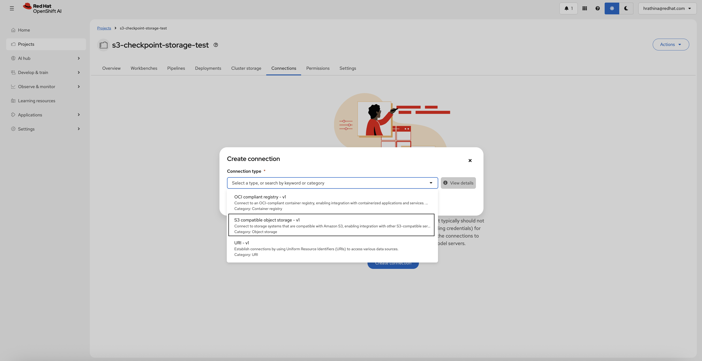

#### Fill in Connection Details

Configure your S3 credentials:

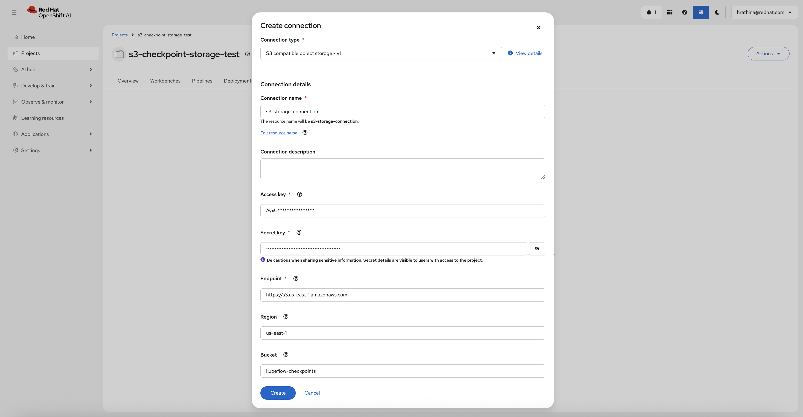

**Required Fields:**

* **Connection name**: A unique name for this connection (e.g., `s3-storage-connection`)
* **Access key**: Your S3 access key ID
* **Secret key**: Your S3 secret access key (will be hidden)
* **Endpoint**: S3 endpoint URL
  * AWS S3: `https://s3.amazonaws.com` or `https://s3.<region>.amazonaws.com`
  * MinIO: `http://minio.example.com:9000`

**Optional Fields:**

* **Connection description**: Optional description for this connection
* **Region**: S3 region (e.g., `us-east-1`)
* **Bucket**: Default S3 bucket name (can be overridden in code)

Click **Create** to save. This creates a Kubernetes secret with your S3 credentials.

#### Copy Connection Name

After creating the connection, you can copy the connection name to use in your training code:

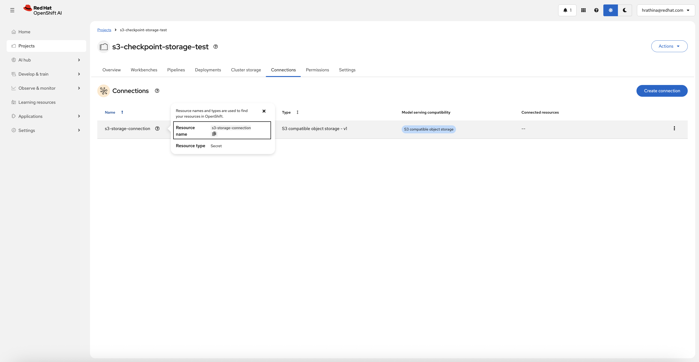

You'll use this connection name in the `data_connection_name` parameter of `TransformersTrainer`.

### 4. Create a Workbench

Once the project is created, click on **Create a workbench** and configure with the following settings:

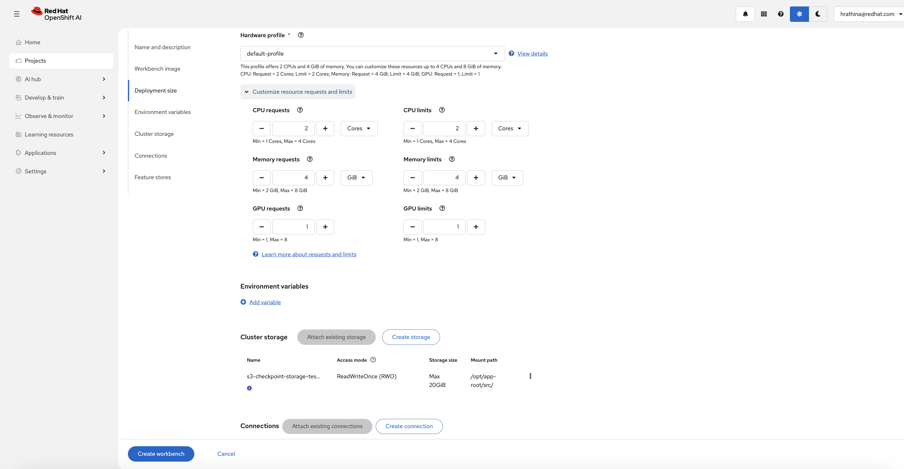

> [!NOTE]
> Adding an accelerator is optional - only needed to test fine-tuned models from within the workbench.

### 5. Create Shared Storage (Optional but Recommended)

Create a storage with RWX or RWO access for caching model and dataset (checkpoints go to S3, not PVC):

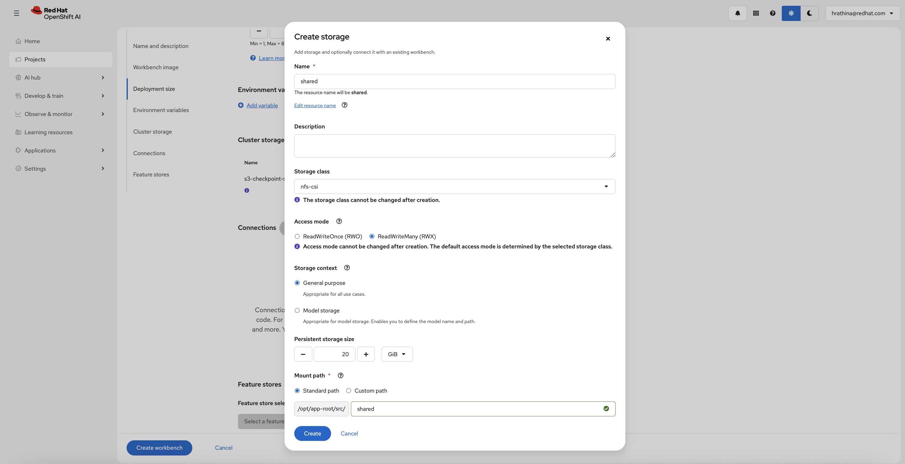

> **Note:** This PVC is only used for pre-downloading the model and dataset. Checkpoints are saved to S3.

**Why create a PVC for model caching?**

* **Saves GPU time**: Without a PVC, the model and dataset must be re-downloaded every time training starts or resumes, wasting valuable GPU time waiting for downloads to complete.
* **Especially important in shared clusters**: In environments where preemptions are common (e.g., when using Kueue or spot instances), having the model pre-cached on a PVC means training can resume immediately after interruption without re-downloading.
* **Right-sized storage**: The PVC only needs to be large enough to store the model and dataset (not checkpoints), typically the size of your model (e.g., 3-5GB for a 1.5B parameter model).
* **Temporary storage**: This PVC can be created just for the duration of training and deleted afterward if storage is limited.

### 6. Start the Workbench

From the "Workbenches" page, click on **Open** when your workbench is ready:

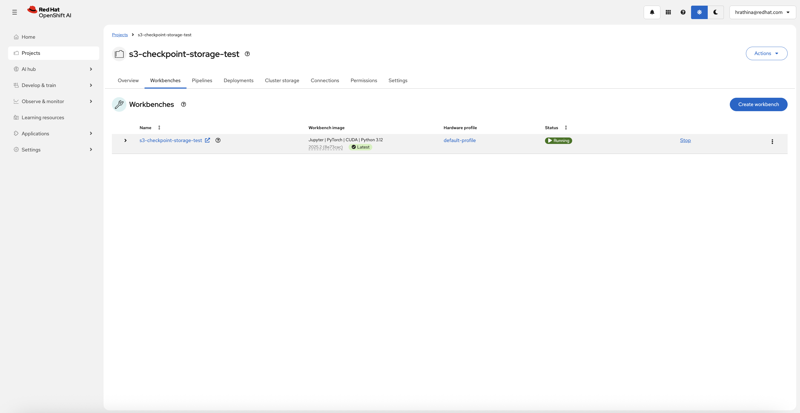

### 7. Clone the Repository

From your workbench, clone this repository:

```bash
git clone https://github.com/red-hat-data-services/red-hat-ai-examples.git
```

Navigate to `examples/trainer/s3-checkpoint-storage` and open the notebook.

## Running the example

The notebook walks you through:

1. **Installing dependencies** — Kubeflow SDK and required packages
2. **Configuring authentication and paths** — API access + PVC mount paths
3. **Staging model and dataset to the PVC** — Download Qwen 2.5 + Alpaca subset from the workbench
4. **Defining the training function** — A `transformers.Trainer` loop that loads inputs from the PVC
5. **Configuring S3 checkpoint storage + submitting TransformersTrainer** — Enable S3 checkpoint upload/download
6. **Verifying checkpoints in S3** — Check checkpoint structure in S3 bucket
7. **Testing the model** — Download and test the fine-tuned model from S3
8. **Cleanup** — Deleting the training job

## Key Features Demonstrated

### S3 Checkpoint Storage

Configure S3 storage for checkpoints using the `output_dir` parameter with S3 URI format:

```python
trainer = TransformersTrainer(
    func=train_func,
    num_nodes=2,
    resources_per_node={"nvidia.com/gpu": 1, "cpu": "4", "memory": "16Gi"},
    # S3 URI format: s3://<bucket-name>/<path>
    output_dir="s3://kubeflow-checkpoints/checkpoints",
    # Name of S3 Data Connection (Kubernetes secret with S3 credentials)
    data_connection_name="s3-storage-connection",
    # Enable JIT checkpointing (save on SIGTERM)
    enable_jit_checkpoint=True,
    # Disable SSL verification for self-signed certs (MinIO)
    verify_cloud_storage_ssl=False,
    # Pre-validate S3 access before job starts
    verify_cloud_storage_access=True,
)
```

When `output_dir="s3://..."` is configured:

1. **S3 Credentials Injection** — SDK loads credentials from the Data Connection secret
2. **Checkpoint Upload** — Checkpoints are saved locally first, then uploaded to S3 asynchronously
3. **JIT Checkpointing** — When SIGTERM is received, training pauses and saves checkpoint to S3
4. **Auto-Resume** — On restart, the latest checkpoint is downloaded from S3 and training resumes

### S3 URI Format

The `output_dir` parameter uses S3 URI format:

```text
s3://<bucket-name>/<prefix-path>
```

**Example:**

```python
output_dir="s3://kubeflow-checkpoints/experiments/qwen-alpaca"
```

This configuration means:

* **Bucket:** `kubeflow-checkpoints` (must exist in your S3 storage)
* **Prefix:** `experiments/qwen-alpaca/` (created automatically if it doesn't exist)
* **Checkpoint locations:**
  * `s3://kubeflow-checkpoints/experiments/qwen-alpaca/checkpoint-20/`
  * `s3://kubeflow-checkpoints/experiments/qwen-alpaca/checkpoint-40/`
  * `s3://kubeflow-checkpoints/experiments/qwen-alpaca/final/`

### Checkpoint Upload to S3

During training, checkpoints are automatically uploaded to S3:

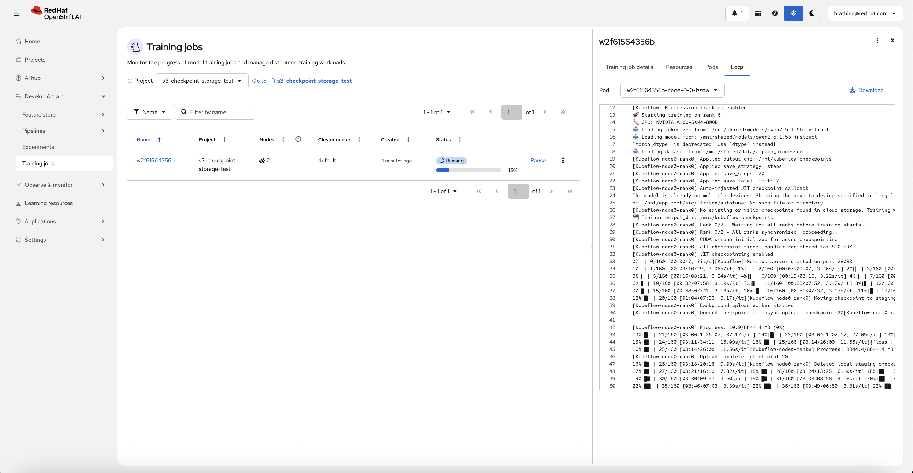

The SDK handles:

* Asynchronous S3 upload (doesn't block training)
* Retry logic for failed uploads
* Validation of uploaded checkpoints

### JIT Checkpointing with S3

JIT (Just-In-Time) checkpointing is **enabled by default** and automatically saves training state to S3 when the pod receives SIGTERM:

```python
trainer = TransformersTrainer(
    func=train_func,
    enable_jit_checkpoint=True,  # Enabled by default - save checkpoint to S3 on SIGTERM
    output_dir="s3://kubeflow-checkpoints/checkpoints",
    data_connection_name="s3-storage-connection",
)
```

When `enable_jit_checkpoint=True` (default):

1. **SIGTERM Handler Registered** — TransformersTrainer registers a signal handler
2. **Safe Checkpoint** — Training pauses after the current optimizer step
3. **S3 Upload** — Model state is uploaded to S3 asynchronously
4. **Sentinel File** — Ensures incomplete checkpoints are detected and cleaned up
5. **Auto-Resume** — On restart, training resumes from the latest valid S3 checkpoint

### Periodic Checkpointing

Configure regular checkpoint saves to S3 using `PeriodicCheckpointConfig`:

```python
from kubeflow.trainer.rhai.transformers import PeriodicCheckpointConfig

checkpoint_config = PeriodicCheckpointConfig(
    save_strategy="steps",    # or "epoch"
    save_steps=20,            # Save every 20 steps
    save_total_limit=2,       # Note: this parameter does NOT limit checkpoints in S3
)

trainer = TransformersTrainer(
    func=train_func,
    periodic_checkpoint_config=checkpoint_config,
    output_dir="s3://kubeflow-checkpoints/checkpoints",
    data_connection_name="s3-storage-connection",
)
```

> **Important:** The `save_total_limit` parameter does **not** clean up old checkpoints in S3. It only controls local checkpoint retention when using PVC storage. With S3 storage, checkpoints are immediately uploaded and all checkpoints remain in S3 regardless of this setting. You must manually delete old checkpoints from S3 if storage cleanup is needed.
>
> **Note:** Checkpoint saves involve uploading to S3, which can take time depending on checkpoint size and network speed. Avoid checkpointing too frequently (e.g., every step) as this can significantly increase total training time.

### SSL Verification

Configure SSL verification based on your S3 storage:

| Parameter | Value | Use Case |
| --- | --- | --- |
| `verify_cloud_storage_ssl` | `True` | Production AWS S3 with valid certificates |
| `verify_cloud_storage_ssl` | `False` | Self-signed certs (MinIO) or internal S3 |

**Security Note:** Always use `True` for production AWS S3. Only use `False` for development/testing with self-signed certificates.

### S3 Access Validation

Pre-validate S3 connectivity before creating training pods:

| Parameter | Value | Behavior |
| --- | --- | --- |
| `verify_cloud_storage_access` | `True` | SDK validates S3 connectivity **before** creating pods (slower, safer) |
| `verify_cloud_storage_access` | `False` | Job submits immediately without testing S3 (faster, may fail during training) |

**Recommendation:** Use `True` for first-time setup to catch S3 configuration errors early.

### Viewing Training Jobs

View your training job status in the OpenShift AI Dashboard:

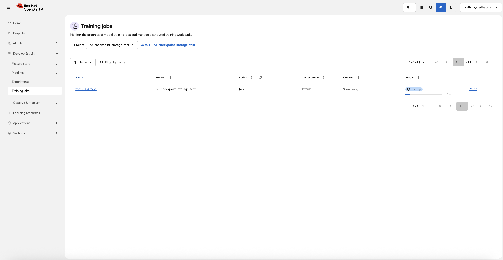

### Pausing and Resuming Training (JIT Checkpoint Demo)

You can pause a running training job to demonstrate JIT checkpointing. When paused, the pod receives SIGTERM and saves a checkpoint to S3:

**Pause the training job:**

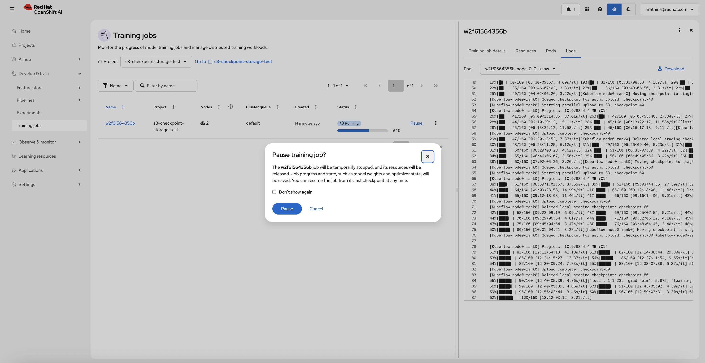

**Job paused - checkpoint saved to S3:**

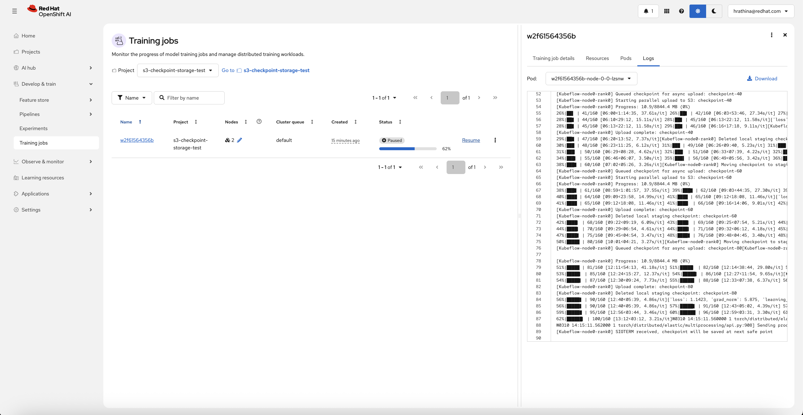

**Resume training - downloads checkpoint from S3 and auto-resumes:**

When the job resumes, the SDK automatically downloads the latest checkpoint from S3 and training continues from where it left off.

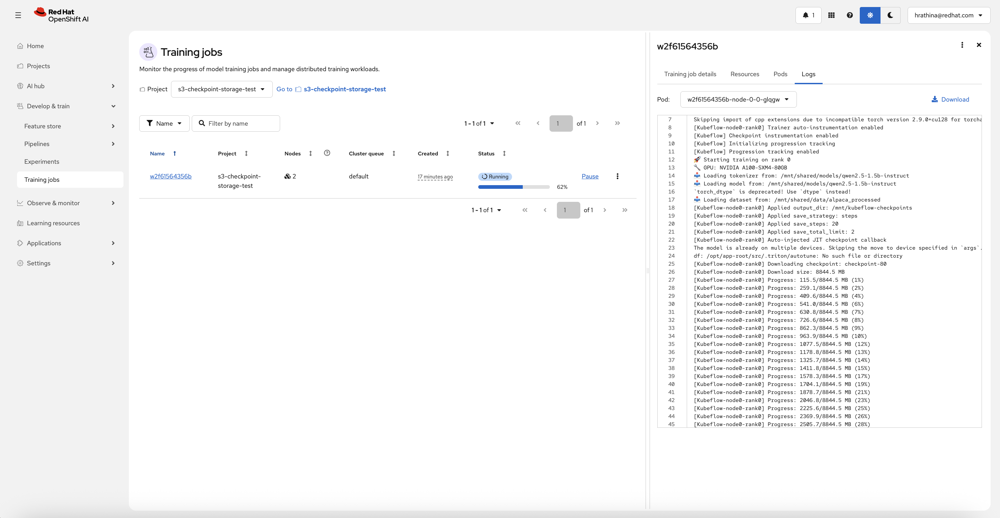

### Checkpoint Structure in S3

The S3 storage replicates the exact local filesystem structure from your training function. Any files and directories created locally during training are automatically uploaded to S3 with the same structure.

**Example structure** (based on this notebook's training function):

```text
s3://kubeflow-checkpoints/checkpoints/
├── checkpoint-20/      # Intermediate checkpoint at step 20
├── checkpoint-40/      # Intermediate checkpoint at step 40
├── checkpoint-<N>/     # Checkpoint at final step (N = last step number)
└── final/              # Final model directory (structure depends on your save_model() call)
```

The final model structure depends on how you call `trainer.save_model(path)` in your training function.

## Distributed Training Best Practices

When configuring multi-GPU training, **prefer using a single node with multiple GPUs** instead of multiple nodes with one GPU each (if your cluster has sufficient resources).

**Recommended configuration for 4-GPU training:**

```python
trainer = TransformersTrainer(
    func=train_func,
    num_nodes=1,                                          # Single node
    resources_per_node={"nvidia.com/gpu": 4, ...},        # 4 GPUs on one node
    output_dir="s3://kubeflow-checkpoints/checkpoints",
    data_connection_name="s3-storage-connection",
)
```

**Instead of:**

```python
trainer = TransformersTrainer(
    func=train_func,
    num_nodes=4,                                          # 4 nodes
    resources_per_node={"nvidia.com/gpu": 1, ...},        # 1 GPU per node
    output_dir="s3://kubeflow-checkpoints/checkpoints",
    data_connection_name="s3-storage-connection",
)
```

### Benefits

| Benefit | Description |
| --- | --- |
| **Faster initial startup** | Model and dataset are downloaded once per job instead of once per node |
| **Faster resume from checkpoints** | Checkpoint is downloaded once instead of duplicated across all nodes |
| **Reduced network traffic** | Eliminates redundant downloads across multiple nodes |
| **Lower S3 egress costs** | Single download vs multiple downloads from S3 |

> **Note:** This recommendation assumes your cluster has nodes with multiple GPUs available. If your cluster only has single-GPU nodes, use `num_nodes > 1` with `resources_per_node["nvidia.com/gpu"] = 1`.

## Customization

You can modify the example for your use case:

| Parameter | Default | Description |
| --- | --- | --- |
| `num_nodes` | 2 | Number of training nodes |
| `resources_per_node["nvidia.com/gpu"]` | 1 | GPUs per node |
| `resources_per_node["cpu"]` | "4" | CPU cores per node |
| `resources_per_node["memory"]` | "16Gi" | Memory per node |
| Model | `Qwen/Qwen2.5-1.5B-Instruct` | Any Hugging Face model |
| Dataset | `tatsu-lab/alpaca` | Any Hugging Face dataset repo |
| `num_train_epochs` | 5 | Training epochs |
| `enable_jit_checkpoint` | `True` | Enable JIT checkpointing to S3 |
| `save_steps` | 20 | Checkpoint frequency |
| `save_total_limit` | 2 | Max checkpoints to keep |
| `output_dir` | `s3://kubeflow-checkpoints/checkpoints` | S3 URI for checkpoint storage |
| `data_connection_name` | `s3-storage-connection` | Name of S3 Data Connection |
| PVC | `shared` | Update `PVC_NAME` in the notebook if you use a different PVC name |

## Troubleshooting

### Job not starting

```bash
# Check TrainJob status
oc get trainjob <job-name> -o yaml

# Check for pending pods
oc get pods -l trainer.kubeflow.org/train-job-name=<job-name>
```

### S3 connection errors

Verify S3 credentials are correct:

```bash
# Check if secret exists
oc get secret <connection-name> -o yaml

# Verify secret contains required keys
oc get secret <connection-name> -o jsonpath='{.data}' | jq 'keys'
```

Expected keys: `AWS_ACCESS_KEY_ID`, `AWS_SECRET_ACCESS_KEY`, `AWS_S3_ENDPOINT`, `AWS_S3_BUCKET`, `AWS_DEFAULT_REGION`

### S3 upload failures

Check training pod logs for S3 errors:

```bash
oc logs <pod-name> -c node | grep -i "s3\|upload\|checkpoint"
```

Common issues:

* Invalid S3 credentials
* Bucket doesn't exist
* Network connectivity issues
* SSL certificate verification failures (use `verify_cloud_storage_ssl=False` for self-signed certs)

### JIT checkpointing not working

Verify the logs show JIT checkpoint initialization:

```bash
oc logs <pod-name> -c node | grep -i "JIT"
```

Expected output:

```text
[Kubeflow] JIT checkpoint signal handler registered for SIGTERM
[Kubeflow] JIT checkpointing enabled
```

### Checkpoints not appearing in S3

1. Verify S3 bucket and prefix are correct:

   ```bash
   oc logs <pod-name> -c node | grep "output_dir"
   ```

2. Check if uploads are failing:

   ```bash
   oc logs <pod-name> -c node | grep -i "upload\|error"
   ```

3. Verify S3 access using AWS CLI or boto3 from the workbench

### Auto-resume not working

Verify checkpoints exist in S3 and are valid (no sentinel files):

```bash
# List checkpoints in S3 bucket
aws s3 ls s3://kubeflow-checkpoints/checkpoints/ --recursive
```

If you see files named `checkpoint-is-incomplete.txt`, those checkpoints are invalid and will be cleaned up automatically on resume.

### Model loading errors in multi-node training

**Symptom:** In multi-node training scenarios, especially under heavy cluster load or limited node bandwidth, one or more ranks may fail with an error like:

```text
OSError: meta-llama/Meta-Llama-3-8B-Instruct does not appear to have a file named
pytorch_model.bin, model.safetensors, tf_model.h5, model.ckpt or flax_model.msgpack.
```

**Cause:** Model cache download takes longer on some nodes compared to others. When a node tries to load the model before the download completes, it fails because the model files are incomplete.

**Solutions:**

1. **Add retry logic in training function** (recommended for robustness):

   ```python
   def train_func():
       import time
       import os
       from transformers import AutoModelForCausalLM, Trainer

       local_rank = int(os.environ.get("LOCAL_RANK", 0))
       model_path = "/mnt/shared/models/qwen2.5-1.5b-instruct"

       # Retry logic for model loading
       max_retries = 6
       for attempt in range(max_retries):
           try:
               model = AutoModelForCausalLM.from_pretrained(
                   model_path,
                   torch_dtype=torch.bfloat16,
                   device_map={"": local_rank},
                   local_files_only=True,
               )
               break
           except OSError as e:
               if attempt < max_retries - 1:
                   print(f"[Rank {local_rank}] Model cache incomplete, retrying in 10s ({attempt+1}/{max_retries})...", flush=True)
                   time.sleep(10)
               else:
                   raise

       # Continue with training...
       trainer = Trainer(model=model, ...)
   ```

2. **Use a shared PVC for model cache** (already implemented in this example):
   * This example pre-downloads the model to a PVC mounted to all training pods
   * Ensures all nodes access the same cached model files
   * See [Step 5: Create Shared Storage](#5-create-shared-storage-optional-but-recommended)

## Additional Resources

* [Kubeflow Trainer Documentation](https://www.kubeflow.org/docs/components/trainer/)
* [HuggingFace Transformers](https://huggingface.co/docs/transformers/)
* [Stanford Alpaca Dataset](https://huggingface.co/datasets/tatsu-lab/alpaca)
* [Boto3 S3 Documentation](https://boto3.amazonaws.com/v1/documentation/api/latest/reference/services/s3.html)
